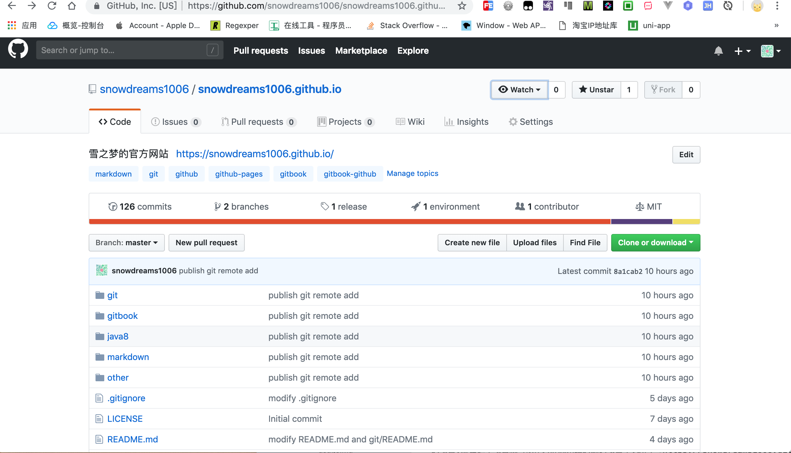
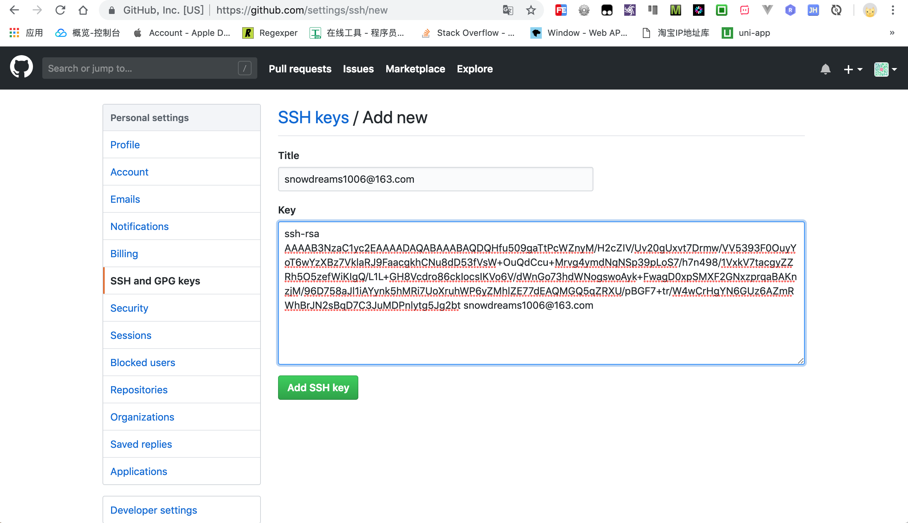
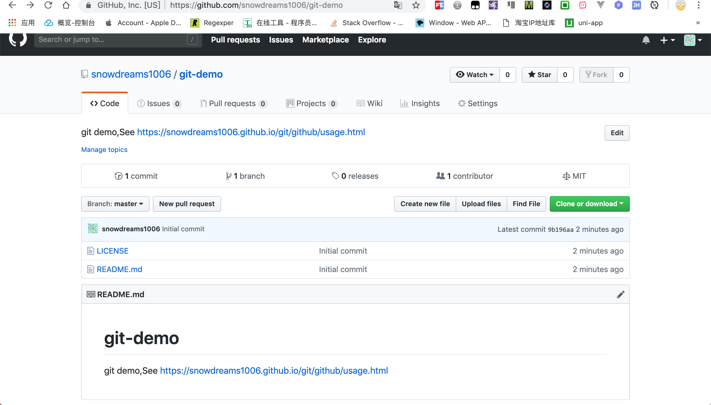
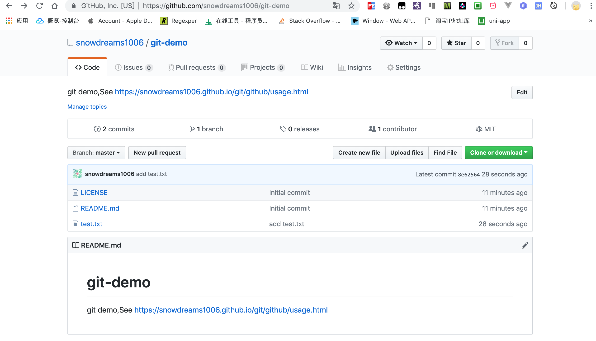

# github 教程

`github` 是一个基于 `git` 的代码托管平台,是平时工作学习的好帮手,学会如何用好 `github` 网站能够帮助我们更好分享代码或者与其他开发人员合作.


## 注册 github 账号

首先准备好邮箱和密码,然后在 [github 官网](https://github.com)注册新账号,和大多数网站类似的注册流程,唯一注意的是你要想好注册类型,针对个人用户来说,一般无外乎个人账号和项目账号两种,比如 [snowdreams1006](https://github.com/snowdreams1006) 就认为是个人账号,而这种 [security-plus](https://github.com/security-plus) 认为是项目账号.

其实这两种账号对于 `github` 来说是一样的,不像是个人账号同企业账号的差异那么大,那为什么称个人账号和项目账号呢?
是因为,大多数个人开发者名下会有多款开源作品,这些作品既可以全部挂载在某一个开发者账号下面,也可以单独挂载某一个开发者账号下面,如果此时的账号名恰好是项目名岂不是清晰多了?

因为个人刚开始可能并没多大名气,如果一个产品直接挂载在个人名下,那么这个产品很大程度上就依赖于个人名气了,所以不妨反过来,用产品说话,事实胜于雄辩,这种做法也是一种常用的宣传手段,很多个人开源产品正是这么做的!

除此之外项目账号还有一个好处,利用 `github` 的静态网站托管服务可以免费快速搭建项目官网,只要创建一个`snowdreams1006.github.io` 的项目,那么这个项目就可以作为静态网站的源码项目了,访问 [https://snowdreams1006.github.io](https://snowdreams1006.github.io) 就能看到项目官网了!

>注意: snowdreams1006仅仅是笔者用户名,实际需要替换成读者的用户名



## 配置 github

既然项目已经托管到 `github` 网站,那本地如何访问到远程仓库呢?常用的方式有两种,一种是 `https` 方式,每次都需要输入密码,另外一种是 `ssh` 方式,只需要一次配置`ssh` 密钥对.

这里我们重点介绍最常用也是最方便的第二种 `ssh` 方式访问 `github` ,大致思路是本地生成密钥对,然后将公钥上传给 `github` 表明身份,之后本地再次推送给远程仓库时,`github` 自然就能识别到我们身份了.

**第一步: 生成密钥对**

默认情况下,会在当前用户目录下生成一对密钥对.

```
ssh-keygen -t rsa -C "youremail@example.com"
```

这里的邮箱 `youremail@example.com` 需要填写自己的 `github` 邮箱,之后会提示输入路径和密码,一路回车采用默认值即可,运行结束后会在当前用户目录下
生成一对密钥对,包括公钥和私钥.其中公钥可以发送给任何人,而私钥千万不可泄露.

**第二步: 复制公钥**

在当前用户根目录下打开 `.ssh` 目录,其中包括两个文件,一个是公钥 `id_rsa.pub` ,另一个是私钥 `id_rsa`,用记事本或者其他方式打开公钥文件,复制其中内容,准备粘贴到`github` 相关设置项.

```
# 查看当前用户下的 ssh 目录
ls ~/.ssh

# 查看生成的公钥内容
cat ~/.ssh/id_rsa.pub
```

**第三步: 设置 github**

回到 `github`,点击头像(Acount),选择设置(Settings),再选择左侧的 SSH and GPG keys,点击右侧的NEW SSH Key,然后填写标题(Title),最好是有意义的名称,比如`youremail@example.com for github`,密钥(Key)填写上一边生成的公钥,一般是以`ssh-rsa` 开头的一大串字符,最后保存(Add SSH Key).




**第四步: 验证 ssh**

利用 `ssh` 协议测试一下是否能够正常访问 `github` 网站,如果出现成功提示,那就证明我们的配置没问题.

```
ssh -T git@github.com
```

## 创建远程仓库

登录 `github` 网站新建远程仓库(New Repository),例如`git-demo`,默认权限是公开的(public),也可以选择私有的(private),初始化 `README.md ` 文件和 `.gitignore` 文件以及选择开源协议这些都是可选的,视具体情况而定.


刷新当前页面,应该能到看到已创建好的`git-demo` 项目,接下来准备将其克隆到本地电脑.



## 克隆到本地仓库

将远程项目克隆到本地工作空间,和之前本地仓库的开发流程一样,例如`add commit status` 等等,唯一不同的是,多了一步 `push` 命令,即本地仓库的最新版本需要推送给远程仓库中,只有这样其他小伙伴才能从远程仓库拉取最新版本,进而才能看到你的代码,因而打破各自为政局面,实现团队协同开发.

```
# 克隆到本地仓库
git clone git@github.com:snowdreams1006/git-demo.git

# 切换到当前项目
cd git-demo

# 创建新文件
touch test.txt
echo "add test.txt" > test.txt

# 添加文件到暂存区
git add test.txt

# 提交文件到本地仓库
git commit -m "add test.txt"

# 推送到远程仓库
git push origin master
```

提交完成后,登录 `github` 网站,刷新当前项目 `git-demo` ,应该能看到我们刚刚提交的新文件`test.txt`.



## 添加仓库关联

添加本地仓库和远程仓库之间关联,默认本地仓库分支名和远程仓库分支名相同

```
git remote add origin2 git@github.com:snowdreams1006/git-demo.git
```

## 查看远程仓库

查看当前配置有哪些远程仓库

```
git remote
```

> 执行时加上`-v` 参数能够查看别名关联的具体地址,即 `git remote -v`

## 下载远程仓库

从远程仓库下载最新分支数据

```
git fetch
```

> 注意: 该命令并不会自动合并当前分支,如需要合并,需手动执行`git merge` 命令

## 拉取远程仓库

从远程仓库拉取最新分支数据,自动尝试合并到当前分支,如有冲突,需先解决冲突再合并到当前分支.

```
git pull
```

> git pull 相当于 git fetch + git merge

## 推送远程分支

将本地最新版本推送到远程仓库

```
git push origin master
```

以上命令将本地 `master` 分支推送到 `origin` 远程仓库的 `master` 分支

## 删除远程仓库

```
git remote rm origin
```