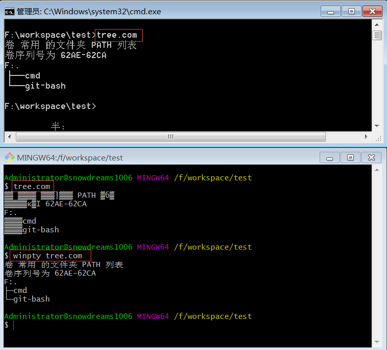
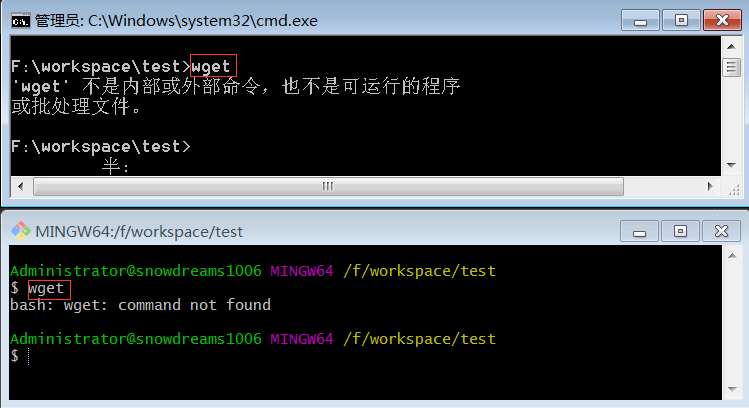
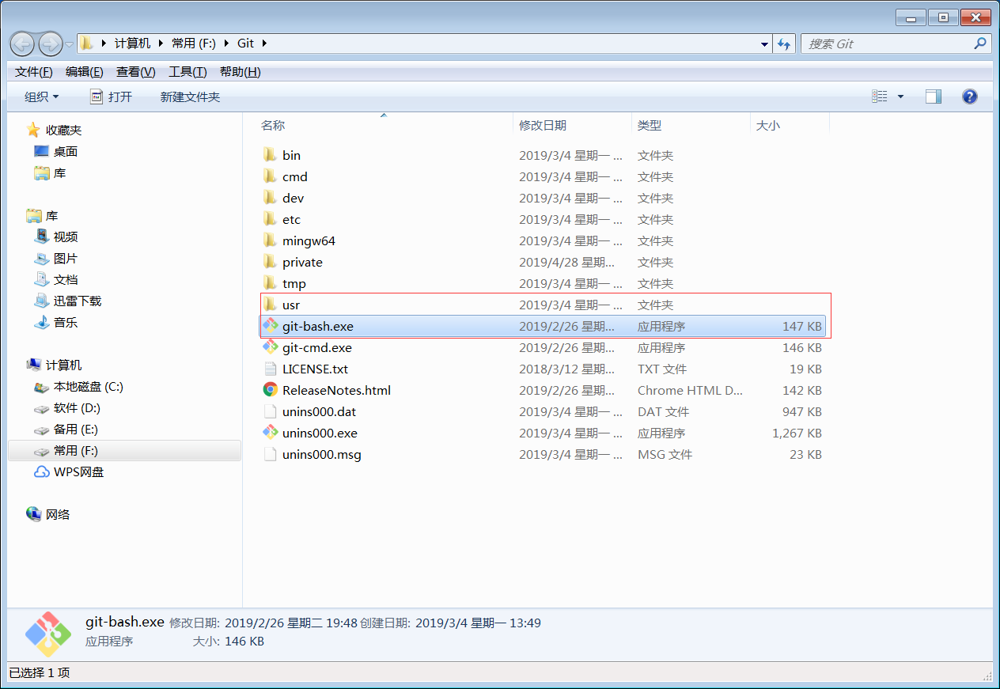
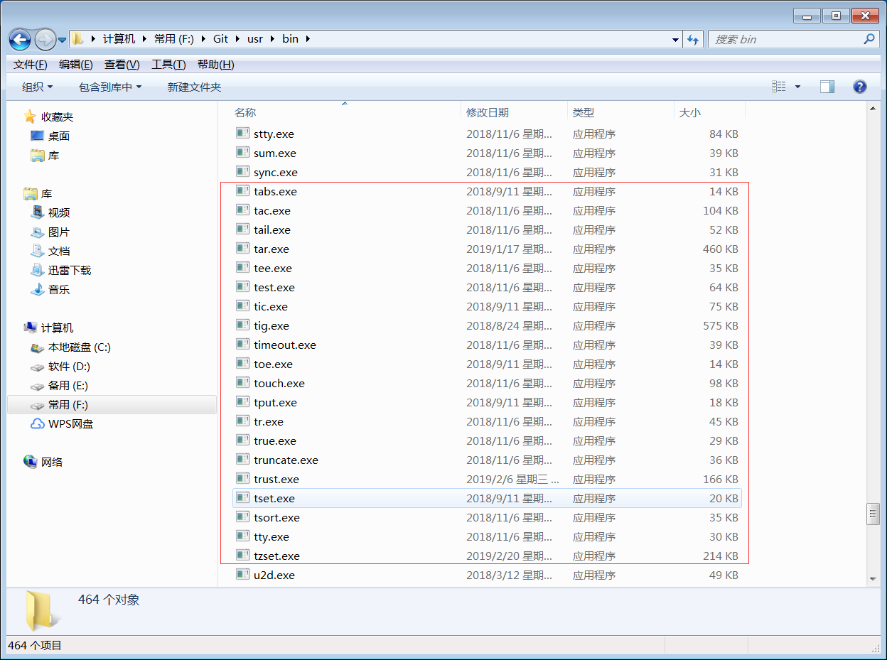

# git bash 扩展命令(中)

## 前情回顾

在上一篇文章中我们介绍了第一种方式实现轻松扩展 `Git Bash` 命令,现在简单回顾一下主要知识.

`Git Bash` 命令行工具是 `Windows` 电脑安装 `Git` 时默认集成的终端工具,与此同时还有双胞胎兄弟 `Git GUI` 图形化工具.


`Git Bash` 和 `Windows` 系统自带的 `cmd` 命令行都可以运行 `Git` 相关命令,二者在这方面差异不大,使用哪一个都可以.

如果更熟悉 `linux` 命令行语法的话,那么建议选择 `Git Bash` 命令行而不能是 `cmd` 命令行.

当然,`Git Bash` 和 `cmd` 作为同类产品,两者并不是互斥的,而应该是互补产品,某些情况下,`Git Bash` 可能还需要调用 `cmd` 才能完成相应任务呢!



> `Git Bash` 调用 `cmd` 程序执行相关命令时,请一定要加上 `winpty` 开头,不然可能会发生意想不到的结果.

## 问题背景

在上一篇文章结尾处,我们留下了一个问题,那就是: 如果 `cmd` 也没有某些命令的话,`Git Bash` 又该如何执行该命令?

正所谓"巧妇难为无米之炊",`Git Bash` 命令行没有 `wget` 命令,`cmd` 命令行也没有 `wget` 命令,因此 `Git Bash` 自然无法调用 `wget` 命令,那么解决思路就很清楚了: 

扩展 `wget` 命令并让 `Git Bash` 识别到 `wget` 命令文件呗!



还记得上篇文章中 `Git Bash` 想要调用 `cmd` 的 `tree` 命令,并不能直接 `winpty tree` 而是 `winpty tree.com` .

```bash
Administrator@snowdreams1006 MINGW64 /f/workspace/test
# 直接输入 ` tree` 命令会提示找不到该命令文件
$ tree
bash: /usr/bin/tree: No such file or directory

Administrator@snowdreams1006 MINGW64 /f/workspace/test
# 输入 `tree.com` 命令则能调用该命令但会出现中文乱码
$ tree.com
▒▒ ▒▒▒▒ ▒▒▒ļ▒▒▒ PATH ▒б▒
▒▒▒▒▒к▒Ϊ 62AE-62CA
F:.
▒▒▒▒cmd
▒▒▒▒git-bash

Administrator@snowdreams1006 MINGW64 /f/workspace/test
# 直接输入 `winpty tree` 命令依旧找不到该命令
$ winpty tree
winpty: error: cannot start 'tree': Not found in PATH

Administrator@snowdreams1006 MINGW64 /f/workspace/test
# 输入 `winpty tree.com` 命令则正常调用该命令
$ winpty tree.com
卷 常用 的文件夹 PATH 列表
卷序列号为 62AE-62CA
F:.
├─cmd
└─git-bash
```

从上述的例子中,我们不难总结出以下结论:

- `Git Bash` 无法识别 `.com` 后缀结尾的命令文件.
- `Git Bash` 调用 `cmd` 命令时应通过 `winpty` 包装器.
- `Git Bash` 查找命令文件的路径也是通过 `PATH` 环境变量设置的,只不过还有自己的命令文件路径.

## 探寻庐山真面目

`Git Bash` 命令行语法不仅和 `linux` 语法一致,而且设计思想基本也差不多,我们知道在 `linux` 中有一句话可以概括整个系统核心: **一切皆文件**

那么 `Git Bash` 所支持的各种命令自然也是文件,只要找到了命令文件自然也就明白为什么不支持 `tree` 命令了,换句话说,下一步我们就知道如何才能支持 `tree` 命令.

在桌面上找到 `Git Bash` 图标的快捷方式,选中该图标**右键**,然后选择**打开文件位置**,现在应该进入到 `Git` 的安装目录了.



接下来,进入 `usr/bin` 目录,你会发现所有可执行的命令文件,你都可以找到但是你并找不到 `tree.exe` 文件,所以无法执行 `tree` 命令.



那么如果我们能够找到 `tree.exe` 文件并将该命令文件放到 `usr/bin` 目录下自然就能够正常调用 `tree` 命令了,但是我们又该去哪里找 `tree.exe` 文件呢?

## 对症下药方能药到病除

`tree.exe` 命令文件千千万,但是适合 `Git Bash` 命令行运行的却并不是全部文件.

想要对症下药,自然要先弄清楚 `Git Bash` 到底属于何门何派,应用了哪些技术栈,这样才能知己知彼,轻松扩展更多命令.

`Git` 原来是 `linux` 系统专属软件,后来由 `Git for Windows` 组织进行了移植,所以现在 `Git` 才能够支持 `Windows` 系统.

`Git for Windows` 在移植 `Git` 的过程中借鉴了大量的开源项目,包括 `minGW` 和 `msys2` 项目.


不查不知道,一查就发现了新大陆,原来想要把 `linux` 软件移植到 `windows` 平台的做法并不孤单,甚至提出了 `WSL` 概念!

> `WSL` : `Windows Subsystem For Linux` 的缩写,即为 `linux` 打造的 `windows` 子系统,可以简单理解为在 `windows` 系统上获得 `linux` 系统的体验.

所以,`Git Bash` 背后的技术支持来源于 `minGW` 和 `msys2` 等 `WSL` 项目.

既然,`Git Bash` 默认没有提供 `tree` 命令文件,那我们就自己动手去扩展 `tree` 命令.

由于暂时没有找到 `minGW` 已编译好的可执行文件,所以只能找其他 `WSL` 项目进行移植,亲测可行!

> `GnuWin` 项目源码托管地址,其中 `GnuWin64` 是 64 位操作系统,`GnuWin32` 是 32 位操作系统,不过 `GnuWin64` 仍在开发计划中,所以我们只能使用 `GnuWin32` .
> 
> `GnuWin64` : [https://sourceforge.net/projects/gnuwin64/](https://sourceforge.net/projects/gnuwin64/)
> 
> `GnuWin32` : [https://sourceforge.net/projects/gnuwin32/](https://sourceforge.net/projects/gnuwin32/)


依次选择 `Files > tree > 1.5.2.2` 便可以找到 `tree` 命令文件,这里提供了各种文件类型,既有源码文件又要安装文件,还有可执行的二进制文件.


> `tree-1.5.2.2-bin.zip` 下载地址: [https://sourceforge.net/projects/gnuwin32/files/tree/1.5.2.2/tree-1.5.2.2-bin.zip/download](https://sourceforge.net/projects/gnuwin32/files/tree/1.5.2.2/tree-1.5.2.2-bin.zip/download)

