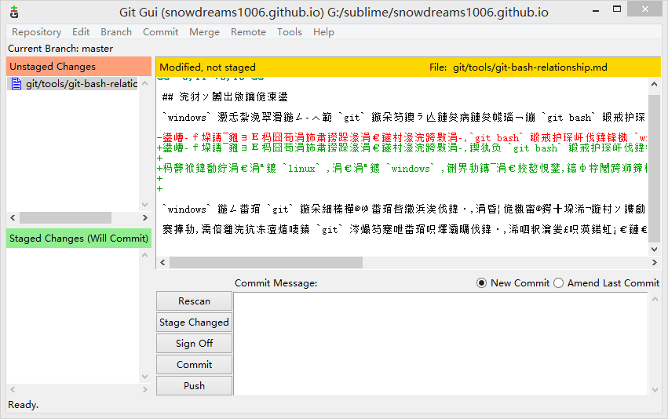

# git bash 复杂关系

> 曾以为 `git bash` 能够**完全取代** `cmd` ,谁知道 `cmd` 却投给我一个鄙视的眼神!

`git bash` 确实能够在一定程度上替代 `cmd` ,但是默认安装的 `git bash` 命令行工具并不能彻底取代 `cmd` ,难怪 `cmd` 听说要让自己退休,会呵呵一笑了!

## 你好陌生老朋友

`windows` 小伙伴们在学习 `git` 时不知道有没有接触过 `git bash` 命令行工具？

反正我是接触过并且仍然在一直在使用中,因为 `git bash` 命令行工具是 `windows` 系统安装 `git` 服务时**默认安装**的扩展工具,它还有一个异卵双胞胎兄弟是 `git gui` 图形化工具.

这两兄弟一个像 `linux` ,一个像 `windows` ,虽然是一母同生,性格长相却千差万别,不过确实是双胞胎兄弟哟!

首先登场的是 `Windows` 系统所喜闻乐见的图形化工具,`git gui` 闪亮登场!

不是说好闪亮登场的吗,怎么右侧文件区是乱码?别急,简单设置下编码方式就能正常显示中文了.

> 在菜单栏选择编辑(`Edit`),然后选择选项(`Options...`),在设置页面左侧中间部分选择文件编码格式(`Default File Content Encoding`) 修改(`Change`)成 `utf-8`.

解决好中文乱码显示问题,现在演示下 `git` 的基本工作流.

`windows` 在安装 `git` 时会默认安装这些工具,主要是帮助我们更好的使用 `git` ,因而推荐集成这些扩展工具.

当然,如果你足够熟悉 `git` 也不必安装扩展工具,仅仅安装最基础最核心的 `git` 服务即可.

或者,你有更好的替代方案,比如更好用的命令行工具或更智能好用的图形化工具,不论处于何种目的,大神都不是一蹴而就的,小白大多数选择的还是默认选项.

所以,下面我们将重新梳理一遍 `git bash` 命令行,重新认识一下**陌生的老朋友**.

> `git bash` 大多数是通过 `git` 服务 [https://git-scm.com/download/win](https://git-scm.com/download/win) 集成安装,或者单独安装 [http://git-for-windows.github.io/](http://git-for-windows.github.io/).

## 回忆那年初相见

> 时光不老,我们不散,`git bash` 陪我们一起走过难忘的那一段路.

`git` 是 `linux` 的缔造者开发出的一款分布式版本控制系统,最初是为了更好的服务 `linux` 系统的开发,后来逐渐风靡全球,成为当今世界上最先进最流行的**分布式版本控制系统**.

学习 `git` 或是工作所需,或是开源精神所驱使,不管出于怎样的目的,只要是想要学习 `git` ,那第一步已经迈出去,接下来的日子里我们都在构建自己的知识库.

如果是目的性非常明确的工作任务,越快越好,跟随项目团队选择一个图形化工具弄清楚基本操作,再配合实际工作需要找到自己的工作流程,这种方式最经济快捷.

如果相对充裕的话,我还是建议学习一下命令行操作.毕竟不是所有的环境都有自己熟悉的开发工具,更何况大牛更喜欢命令行操作,更炫酷更有型,不是吗？

`linux` 系统主要操作方式是命令行,`mac` 系统自带的终端也能很好支持命令行操作,唯独 `windows` 自带的 `cmd` 命令行有点差强人意了.

明明有各种各样的图形化工具,偏偏要学习命令操作,为什么？

原因很简单：

1. 记住命令有利于我们更加了解团队开发的工作流程以及自己在什么位置.
2. 熟悉命令行后我们可以自由组合任意命令,从而定义属于自己的工作流.
3. 更加接近真实生产环境,临时从开发环境切换到生产环境不至于措手不及.
4. 各种图形化工具存在差异性,换个图形化工具又要重新记忆按键位置.
5. 图形化工具不能随心所欲控制细节,功能受限,无法或者很难自定义扩展.

以上原因只是一家之言,切勿当真也不要较真,仅供参考.

> 正如"自相矛盾"故事中那样,没有绝对的最好,适合自己的才是最好的.

诚然,最初使用命令行操作 `git` 时,确实不太习惯,大多数人还是习惯图形化界面.

但是,现在想一想也没有那么难,不是吗？

- `git init` 或者 `git clone` 用于初始化项目.
- `git add` 和 `git commit` 用于提交版本.
- `git status` 和 `git diff` 用于查看状态.
- `git push` 和 `git pull` 用于更新版本。
- `git branch` 和 `git tag` 用于开发和发布.
- ...

当这些熟悉的命令一遍又一遍出现时,你还是觉得难吗,你说记不住那可能是你练习得还不够.

## 时光易老薄性情

> 恰逢春风正得意,忽遇桃花败满地.

`git bash` 命令行操作让我们熟悉 `git` 基本工作流程,无论是命令行操作还是图形化工具,基本概念不会变,上手很快.

甚至,还会思考一个简单的按钮可能会涉及到哪些命令的组合,看看我们的思考和实际运行的命令有什么出入,潜移默化又提高了学习层次.

然而,事情的发展变化总不是一帆风顺的,尤其是换个环境时这种变化更为突出.

正如天天吃肉的皇帝面对闹饥荒吃不上饭的灾民,不明白他们为什么不吃肉呢？

长时间处在一个环境中,思维很容易固化,理所当然认为世界本该如此,正是这些"理所应当"才弄出不少笑话.

`windows` 系统自带的 `cmd` 风格丑陋,功能简单,不怎么受人待见.

所以,当 `git` 提供的 `git bash` 命令行工具能满足日常管理所需时自然不会再考虑 `cmd` .

毕竟,`git bash` 不仅操作界面漂亮而且功能体验也不错,基本的 `bash` 功能足够应付日常开发需求.

长此以往,潜意识中认为 `git bash` 能够完全替代 `cmd`,这种想法是不对的！

实际上,`git bash` 并不能完全替代 `cmd` ,可以作为 `cmd` 的扩展补充,原配始终是原配！

有些命令，`git bash` 没有提供就认为 `cmd` 肯定也没有,毕竟 `cmd` 命令行操作和 `linux` 命令行操作完全不是一个体验.

比如本人最近正在学习如何开发 `gitbook` 插件,跟着教程练习需要在看到目录结构是否一致,很自然想到了`tree` 命令,结果却发现查无此命令.

没有命令的话,可以理解,至少应该提供包管理工具供我自由扩展命令吧？很抱歉,并没有找到类似的包管理工具.

一味信任 `git bash` 直接导致的结果就是根本没有想到 `cmd` 自带的命令,事实上,`cmd` 是带有 `tree` 命令的.

## 探求庐山真面目

> 回到起点,重温当初走过的路.

