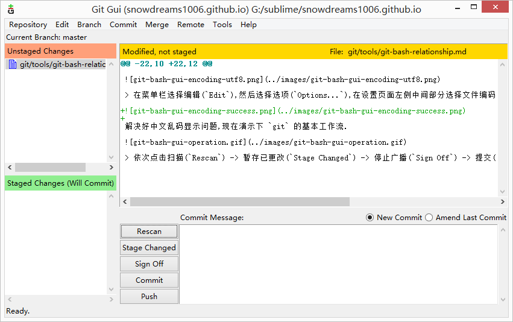
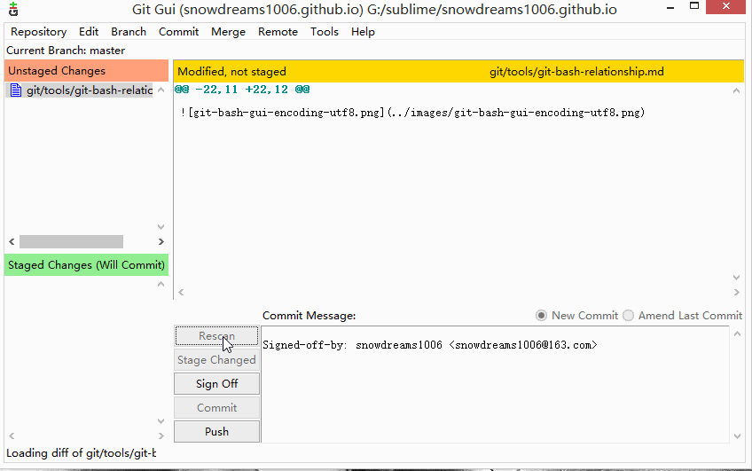
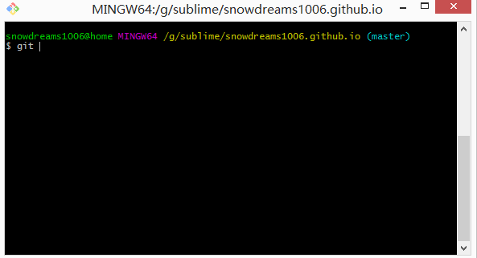
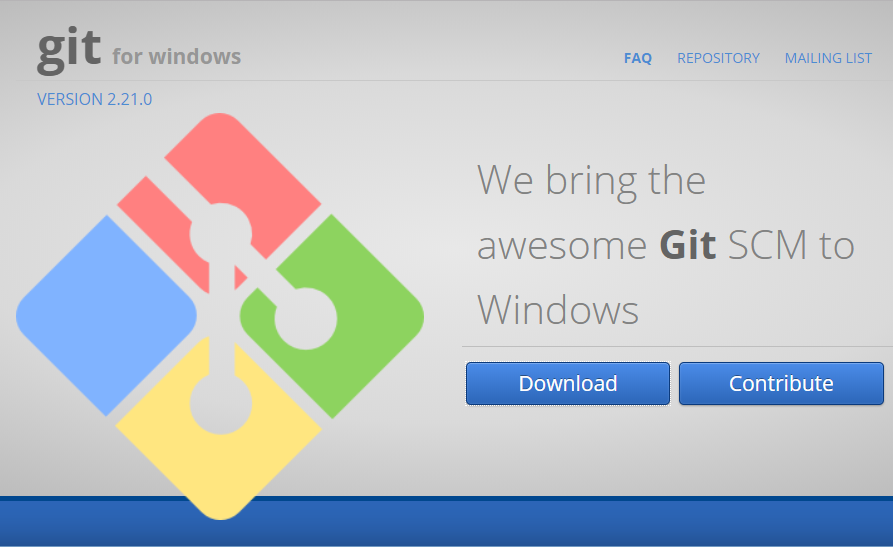
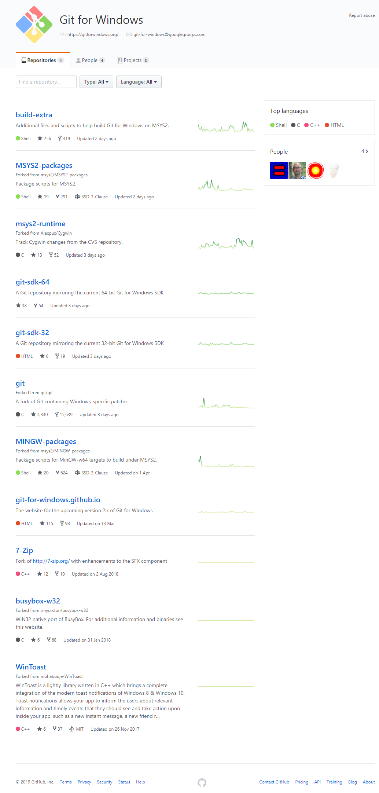
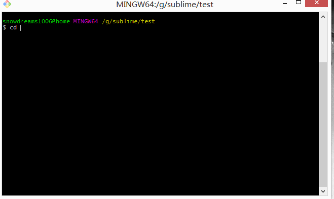

# git bash 复杂关系

> 曾以为 `git bash` 能够**完全取代** `cmd` ,谁知道 `cmd` 却投给我一个鄙视的眼神!

`git bash` 确实能够在一定程度上替代 `cmd` ,但是默认安装的 `git bash` 命令行工具并不能彻底取代 `cmd` ,难怪 `cmd` 听说要让自己退休,会呵呵一笑了!


## 你好陌生老朋友

`windows` 小伙伴们在学习 `git` 时不知道有没有接触过 `git bash` 命令行工具？

反正我是接触过并且仍然在一直在使用中,因为 `git bash` 命令行工具是 `windows` 系统安装 `git` 服务时**默认安装**的扩展工具,它还有一个异卵双胞胎兄弟是 `git gui` 图形化工具.

这两兄弟一个像 `linux` ,一个像 `windows` ,虽然是一母同生,性格长相却千差万别,不过确实是双胞胎兄弟哟!

首先登场的是 `Windows` 系统所喜闻乐见的图形化工具,`git gui` 闪亮登场!


不是说好闪亮登场的吗,怎么右侧文件区是乱码?别急,简单设置下编码方式就能正常显示中文了.


> 在菜单栏选择编辑(`Edit`),然后选择选项(`Options...`),在设置页面左侧中间部分选择文件编码格式(`Default File Content Encoding`) 修改(`Change`)成 `utf-8`.



解决好中文乱码显示问题,现在演示下 `git` 的基本工作流.



> 依次点击扫描(`Rescan`) -> 暂存已更改(`Stage Changed`) -> 停止广播(`Sign Off`) -> 提交(`Commit`),完成一次文件修改后的提交操作.

其次登场的是 `linux` 小伙伴很熟悉的命令行操作方式,唤醒方式和上述工具的方式基本一致,选中项目的根路径**右键**选择`Git Bash Here` 跳出命令行窗口.



> `git --version` 查看 `git` 版本,`git status` 查看文件状态,`git add` 添加文件,`git commit` 提交文件.

现在两兄弟分别登台亮相,向大家展示了基本的操作流程,虽然操作方式不同,但最终目的确实一致的,这一下应该认同他们俩确实是亲兄弟了吧.

下面我们重点讨论下 `git bash` 命令行工具,看 `git` + `bash` 会擦除什么样的火花,让我们重新认识一下这个**陌生的老朋友**.



> `git bash` 命令行工具大多数情况下是通过安装 [git](https://git-scm.com/download/win) 时进行集成安装的,当然也不排除[单独安装](http://git-for-windows.github.io/)的可能性.

## 回忆那年初相见

> 时光不老,我们不散,`git bash` 陪我们一起走过难忘的那一段路.

`git` 是 `linux` 的缔造者开发出的一款**分布式版本控制系统**,最初是为了 `linux` 系统的多人协同开发,后来逐渐风靡全球,如今已成为**最先进最流行**的**分布式版本控制系统**.


最初 `git` 只支持 `linux` 操作系统,后来 `windows` 系统也慢慢支持了,只不过这种支持并不是 `git` 官方所为,而是**微软**团队进行移植整合的产品.



> `git` 是分布式版本控制系统,源代码托管在 `github` 网站,`github` 是知名度很高的在线代码托管平台.

从上述两张图中,我们不难得出以下结论.

- `Git` 的官网是 [https://git-scm.com](https://git-scm.com),`Git` 组织主要负责维护 `git` 项目和 `git-scm` 网站.
- `Git for Windows` 的官网是 [https://gitforwindows.org/](https://gitforwindows.org/),`Git for Windows` 组织项目明显多了不少,不仅要维护`Git` 还要提供移植 `Git` 所需的一系列后勤支持.
- `Git` 支持 `Windows` 本身的行为来源于 `Git for Windows` 组织,并不是 `Git` 天然支持的功能.
- `Git for Windows` 组织项目大部分来源于其他开源项目,也就是说将 `Git` 移植到 `Windows` 系统背后需要很多技术支持.

> `Git` 本身是 `linux` 系统的软件,所以类 `linux` 系统的 `mac` 是**天然支持**的,而差异比较大的 `Windows` **无法天然支持**,所以 `Git for Windows` 组织移植了 `Git` ,从而实现了**变相支持**.	

学习 `git` 或是工作所需,或是开源精神所驱使,不管出于怎样的目的,只要是想要学习 `git` ,那第一步已经迈出去,接下来的日子里我们都在构建自己的知识库.

如果是目的性非常明确的工作任务,越快越好,跟随项目团队选择一个图形化工具弄清楚基本操作,再配合实际工作需要找到自己的工作流程,这种方式最经济快捷.

如果时间相对充裕,建议学习一下命令行操作.毕竟不是所有的环境都有自己熟悉的开发工具,更何况大牛更喜欢命令行操作,更炫酷更有型,不是吗？

明明有各种各样的图形化工具,为什么偏偏要学习命令操作,原因其实很简单：

- 记住命令有利于我们更加了解团队开发的工作流程以及自己在什么位置.
- 熟悉命令行后我们可以自由组合任意命令,从而定义属于自己的工作流.
- 更加接近真实生产环境,临时从开发环境切换到生产环境不至于措手不及.
- 各种图形化工具存在差异性,换个图形化工具又要重新记忆按键位置.
- 图形化工具不能随心所欲控制细节,功能受限,无法或者很难自定义扩展.

> 以上原因只是**一家之言**,切勿当真也不要较真,仅供参考,仅此而已.

回想起当初使用命令行操作 `git` 时,确实不太习惯,和大多数人一样最初还是习惯图形化操作工具.

但是,现在想一想命令行操作其实也没有那么难,简单的命令重复练习,自然而然就记住了,不是吗？

- `git init` 或者 `git clone` 用于初始化项目.
- `git add` 和 `git commit` 用于提交版本.
- `git status` 和 `git diff` 用于查看状态.
- `git push` 和 `git pull` 用于更新版本。
- `git branch` 和 `git tag` 用于开发和发布.
- ...

## 忽遇阵雨摧花枝

> 三月春风正得意,忽遇阵雨摧花枝.曾以为不会再用到 `cmd` 命令行,事实证明 `git bash` 并不是万能的.

命令行操作最直观的好处就是高效简单,手不必离开键盘,持续输入不被打断.

正所谓"工欲善其事必先利其器",使用命令行操作需要有顺手的命令行工具,而 `windows` 自带的 `cmd` 命令行工具功能太弱了,并且和基本的 `linux` 体验根本不一致.

所以,基本上不会使用 `cmd` 命令行,而安装 `git` 时恰巧给我们提供了 `git bash` 命令行工具,不仅可以用它操作 `git` ,日常工作中使用它也是绰绰有余.

比如,我们使用 `cmd` 和 `git bash` 打开指定目录,看一下两者的表现自然明白为什么要使用 `git bash` ?


> `cmd` 想要切换到指定目录,首先需要切换**盘符**,然后再使用 `cd` 命令切换到该盘符下的指定目录.



> `git-bash` 想要切换到指定目录,只需要使用 `cd` 命令直接切换到指定目录.

因为 `Windows` 系统自带的 `cmd` 命令行工具走的是 `Windows` 逻辑,所以如果用 `linux` 命令行那套逻辑肯定行不通.

换句话说,如果想要直接使用 `cmd` 命令行,需要重新学习 `cmd` 相关知识,除非有着特定的工作场景,不然我实在不明白为啥要**单独学习**`cmd`?

因为 `linux` 那套命令行逻辑有着真实的应用场景,所以学习命令行基本上算是工作必备技能,而 `windows` 的命令行则没有这层实际意义,那么自然是希望能够在 `windows` 上获取类似于 `linux` 那样的体验.

所以,当 `git` 提供的 `git bash` 命令行工具能满足日常管理所需时自然不会再考虑 `cmd` 命令行.

毕竟,`git bash` 不仅操作界面漂亮而且功能体验也不错,提供了基本的 `bash` 功能足够应付日常开发需求.

然而,长此以往潜意识中认为 `git bash` 能够完全替代 `cmd`,但是这种想法是不对的！

比如有些命令，`git bash` 没有提供就认为 `cmd` 肯定也没有,实际中运行 `tree` 命令能够清楚验证这种情况.

`git bash` 命令行中运行 `tree` 命令发现查无命令.

```bash
$ tree
bash: tree: command not found
```

`cmd` 命令行中运行 `tree` 命令可正常显示当前目录树结构.

```bash
G:\sublime\test>tree
卷 工作 的文件夹 PATH 列表
卷序列号为 000000C8 CC3C:50D0
G:.
├─cmd
└─git
```

## 探求庐山真面目

> 圣贤告诉我们要"只知其然知其所以然",为什么 `git bash` 不支持 `tree` 命令?

重温当初走过的路,试图从安装 `git` 时能否找到蛛丝马迹,大多数情况下我们是采用安装 `git` 顺带集成的`git bash` 命令行工具.

下载安装的无关截图这里就不展示了,一步一步重新安装 `git` 时看到了一点蛛丝马迹.


`MinTTY` 是 `MSYS2` 的默认终端,`git bash` 将使用 `MinTTY `作为终端模拟器,如有需要调用`Windows` 程序必须通过 `winpty` 才能正常工作.


