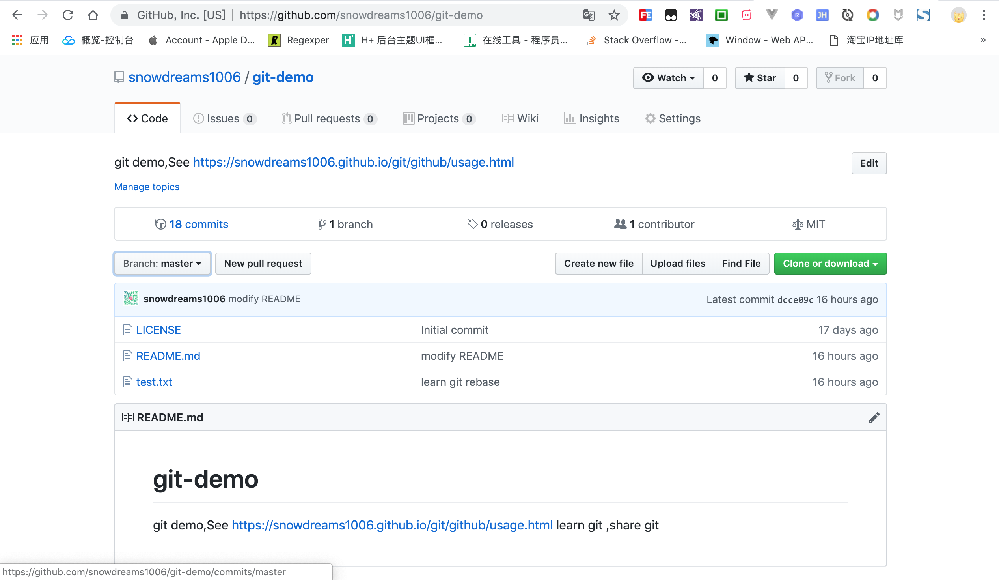
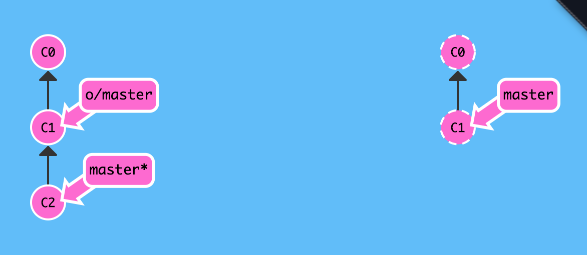
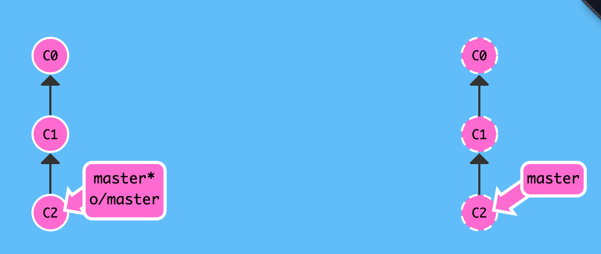
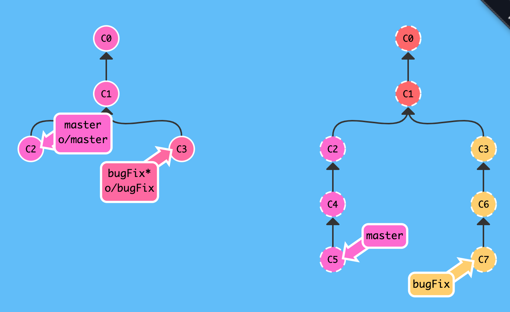
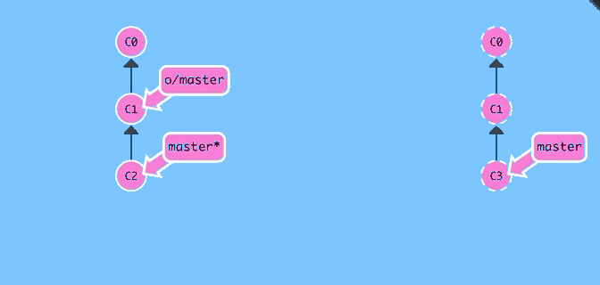

# 协同开发

前面我们介绍了远程仓库的相关概念,是团队协同开发的基础,也是代码备份的保障手段,现在我们简单回顾胰腺癌,以便为接下来的协同开发做好铺垫!

## 远程仓库和远程分支

### 远程仓库

**远程仓库**其实并不复杂,实际上只是本地电脑的本地仓库在另一台远程电脑的备份而已,相对本地的仓库来说自然就是远程仓库,有了远程仓库代码更安全了,即使丢失了本地全部数据,只要远程仓库没有丢失,我们就可以通过远程仓库重新取回最新数据!还有一点,远程仓库让代码社交化,因为大家都有相同的途径访问远程仓库,团队也好或者陌生人也罢,只有你愿意,他们就可以获取远程仓库的最新代码并参与开发,这也是 `github` 的一大优势!

### 远程分支

回顾完远程仓库的概念后,我们再来讲一下本地仓库的**远程分支**是什么意思?

你正在工作的电脑上存储的是本地仓库,如果没有远程仓库的支持,只能一个人鼓捣,别人无法进入,现在加入了团队开发流程,自然不能一个人独自开发了,需要和团队其他人协同开发,共享开发成果.

所以本地仓库势必保存着远程仓库的基本信息,只有区分好自己的工作成果和公共的工作成果,这样才既不会乱她,又能做到信息及时发布共享.

实际上,项目初期刚刚拷贝远程仓库(`git clone`)时,`git` 会默认在本地仓库创建一个远程分支(`origin/master`),本地修改提交首先都是在本地仓库完成的,比如 `git add`,`git commit` 等命令,如果需要发布你的工作成果,那么就需要使用 `git push origin <branch>` 命令推送到远程仓库,这里的 `origin` 指的就是远程仓库名称(因为最初大家都是先从远程仓库克隆下来的,所以远程仓库存储的项目相当于原始项目,故而叫`origin`).


`git clone` 命令帮助本地仓库的 `master` 分支和远程仓库的 `master` 分支建立了关联,一般称远程仓库名称为 `origin`.

#### **查看远程仓库信息** : `git remote` 或 `git remote -v`

```
# 查看远程仓库名称
$ git remote
origin

# 查看远程仓库详情 : 拉取和推送链接
$ git remote -v
origin  git@github.com:snowdreams1006/git-demo.git (fetch)
origin  git@github.com:snowdreams1006/git-demo.git (push)
$ 
```

#### **本地分支推送到远程仓库** : `git push origin <branch>`

本地仓库和远程仓库的分支理论上应该一一对应,正常本地仓库的主干分支叫做 `master` ,而远程仓库也有相应的分支叫做 `master` ,这种映射关系是使用 `git clone` 命令时默认生成的,也是推荐的做法.

所以如果本地仓库的分支推送到远程仓库一般指的是推送到远程仓库同名的分支上,`git push origin master` 推送本地 `master` 分支,`git push origin dev` 就是推送本地 `dev` 分支.

按照之前约定的分支管理策略来说,本地 `master` 分支用于**生产环境**部署,`dev` 分支用于**收集开发成果**,`feature` 分支用于**开发具体功能**分支,既然如此,那这些本地分支哪些需要**同步推送**到远程仓库就比较清晰了!

- 推送本地 `master` 分支到远程仓库的 `master` 分支 : `git push origin master`
- 推送本地 `dev` 分支到元层仓库的 `dev` 分支 : `git push origin dev`

```
# 查看当前分支 : `master` 主分支
$ git branch
  dev
* master
  snow

# 推送本地 `master` 分支到远程仓库 `origin` 上相应的 `master` 分支 
$ git push origin master
Counting objects: 15, done.
Delta compression using up to 4 threads.
Compressing objects: 100% (15/15), done.
Writing objects: 100% (15/15), 1.31 KiB | 1.31 MiB/s, done.
Total 15 (delta 9), reused 0 (delta 0)
remote: Resolving deltas: 100% (9/9), completed with 3 local objects.
To github.com:snowdreams1006/git-demo.git
   e60c8ad..dcce09c  master -> master
$ 
```



正常来说,本地仓库的 `master` 分支应该领先远程仓库 `origin` 上的 `master` 分支若干个版本.



一旦我们已经将本地分支上的工作成果推送到远程仓库上相应分支时,本地仓库和远程仓库这时候就保持一致了.

```
$ git status
On branch master
Your branch is up to date with 'origin/master'.

nothing to commit, working tree clean
$ 
```



#### **远程仓库下载到本地分支** : `git fetch`

远程仓库的操作可以简单归纳为两部分: 上传和下载.本地仓库推送到远程仓库是上传,那远程仓库拉取到本地仓库是下载.

团队多人协作开发时,大家都会定期或不定期徃 `master` 和 `dev` 分支推送各自的更改,现在我们就需要模拟这种场景下如何下载别人的最新工作成果.

现在模拟另一个小伙伴正在往 `master` 分支上推送更改,最好在另一个电脑另一个账户,也可以是同一个电脑下其他目录,或者最简单的方式,登录 `github` 直接更改 `master` 分支上某个文件内容,在这里为了简单起见,我们采用最后一种方式.

模拟另外小伙伴往远程仓库上的 `master` 分支提交了新的版本: 创建 `git-remote.txt` 文件


现在我们想要下载小伙伴的最新工作成果,接下来让我们看看本地仓库的 `master` 还能和远程仓库的 `master` 分支保持一致吗?



```
# 下载远程仓库的 `master` 分支
$ git fetch origin master
remote: Enumerating objects: 4, done.
remote: Counting objects: 100% (4/4), done.
remote: Compressing objects: 100% (2/2), done.
remote: Total 3 (delta 0), reused 0 (delta 0), pack-reused 0
Unpacking objects: 100% (3/3), done.
From github.com:snowdreams1006/git-demo
 * branch            master     -> FETCH_HEAD
   dcce09c..10942ff  master     -> origin/master
$ 
```


执行 `git fetch` 命令后,远程仓库上的最新更改下载到本地仓库,同时更新了本地仓库的远程分支`origin/master` ,值得注意的是本地仓库的 `master` 分支并没有更新!

那你可能会有疑问了,我想要的结果是下载其他人的最新工作成果,怎么我本地仓库的 `master` 分支并没有更新呢?

```
# 查看工作区
$ ls
LICENSE     README.md   test.txt

# 查看版本库状态
$ git status
On branch master
Your branch is behind 'origin/master' by 1 commit, and can be fast-forwarded.
  (use "git pull" to update your local branch)

nothing to commit, working tree clean
$ 
```

既然 `git fetch` 并没有更新本地仓库的 `master` 分支,那它到底做了哪些工作呢?

**`git fetch 会做的事情`**

实际上, `git fetch` 完成了仅有的但是很重要的两步操作:

- 从远程仓库下载本地仓库中缺失的提交记录
- 更新本地仓库的远程分支(比如`origin/master`)

通过上述两步操作完成的效果是: **将本地仓库中的远程分支更新成了远程仓库相应分支最新的状态**.

**远程分支**实际上是反映了**远程仓库**在你最后一次与它通信时的状态,而`git fetch` 就是你与远程仓库通信的方式了！

**`git fetch 不会做的事情`**

`git fetch` 并不会改变你本地仓库的状态,所以也就不会更新你的 `master`分支,自然也不会修改你磁盘上的文件.

理解这一点很重要,因为许多开发人员误以为执行了 `git fetch` 以后，他们本地仓库就与远程仓库同步了.

实际上它可能已经将进行这一操作所需的所有数据都下载了下来,但是并没有修改你本地的文件.

> 既然本地仓库的远程分支已更新,那么想要更新本地仓库的 `master` 分支该如何做呢?很简单,可以 `git merge` 啊!

#### **远程仓库更新到本地分支** : `git pull`

其实通过 `git fetch` 命令我们已经下载了远程仓库的最新版本,只不过没有合并到本地仓库而已,如何合并分支相信大家已经轻车熟路了,有很多方法:

- `git merge origin/master`
- `git rebase origin/master`
- `git cherry-pick origin/master`

实际上,先抓取更新(`git fetch`)再合并(`git merge`)到本地分支这个流程很常用,因此 `git` 是有专门的命令来完成这两步操作的,这就是拉取更新**`git pull`** --- 刚好与推送更新 `git push` 相反!

```
# 拉取最新版本
$ git pull
Updating dcce09c..10942ff
Fast-forward
 git-remote.txt | 1 +
 1 file changed, 1 insertion(+)
 create mode 100644 git-remote.txt

# 查看版本库状态
$ git status
On branch master
Your branch is up to date with 'origin/master'.

nothing to commit, working tree clean

# 查看工作区内容: 文件已更新
$ ls
LICENSE     README.md   git-remote.txt  test.txt
$ 
```



