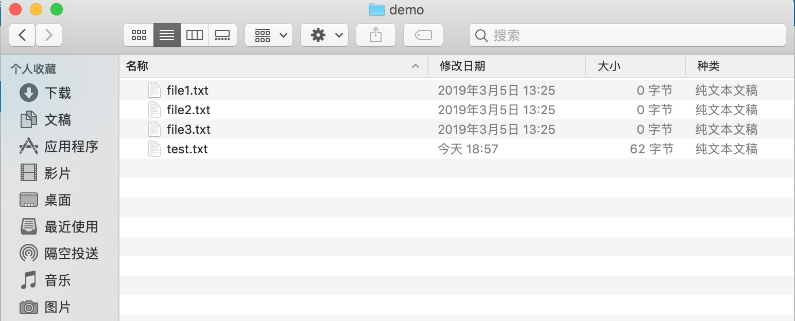
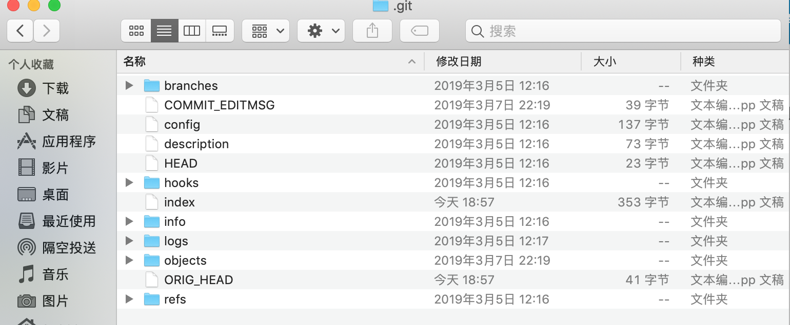

# 基本概念

了解工作区,暂存区和版本库的区别和联系有助于我们更好理解 `git` 的工作流程,了解命令的操作意图.

> `git` 和其他版本控制系统如 `svn` 的不同之处就是有暂存区的概念.

## 基本概念

- **工作区 | Working Directory**

正常情况下能看到的目录(不包括隐藏文件),也就是用户主动创建的目录



- **暂存区 | Stage** 

工作区下的隐藏`.git`目录下的`.index`文件,因此也称为索引.

- **版本库 | Repository**

工作区下的隐藏目录`.git`目录



通过前几节我们知道,将文件纳入版本控制,需要分两步操作:

- 第一步 `git add` 添加文件,实际上是将文件更改添加到暂存区.
- 第二步 `git commit` 提交更改,实际上是将暂存区所有内容提交到当前分支.

我们使用 `git init` 命令初始化创建 `git` 仓库时,`git` 会自动创建唯一一个 `master` 分支,默认所有操作是在 `master` 分支上进行的,所以 `git commit` 就是徃 `master` 分支上提交更改的.

通俗地讲,文件更改可以多次添加到暂存区,即允许多次执行 `git add` 命令,然后一次性提交暂存区的全部更改到版本库,即只需要执行一次 `git commit` 命令即可.

说说个人理解 `git` 为何分成三部分进行版本控制操作,二部分行不行?

答案是肯定的,没有暂存区概念的 `svn` 同样可以进行版本控制,所以 `git` 增加暂存区必然是有存在的意外也就是所谓的好处的.

第一,暂存区的概念允许将本地文件的更改添加进来,也就是说本地文件的更改只有添加到暂存区才能进行下一步的提交更改,所以说那些更改添加到暂存区是由开发者本人决定的,这其实有了一定灵活性,并不是所有的更改都需要被记录!

第二,暂存区作为中间过程,暂存区的内容是打算提交更改的内容,也就是说暂存区可以视为一种临时缓存,用来记录预提交更改.实际工作中,新功能的开发并不是一蹴而就的,是由一系列的更改一起组成的,如果将这些更改分散开来单独提交,那势必会产生很多`commit`,如果等待全部工作完成再提交的话,解决了过多`commit`的问题,但是又遇到新问题就是你可能很长时间才能提交一次更改,失去了版本控制的意义.综上所述,暂存区的出现一种很好的解决方案,它允许将相关性代码添加在一起,方便后续提交更改时提交的都是相关性代码!

第三,作为分布式版本控制系统,不像集中式控制系统那样,对网络强相关,失去网络的 `svn` 是没办法再进行版本控制的,但失去网络的 `git` 仍然可以进行版本控制,只不过不能远程操作了而已,不过这部分也是无可厚非的,正所谓"巧妇难为无米之炊",你总不能要求断网下继续访问百度吧!

好了,我们继续回到 `git` 常用操作上,看一下工作区,暂存区和版本库三者如何协同工作的.

首先,先修改`test.txt`文件.

```
# 查看 test.txt 文件内容
$ cat test.txt
git test
git init
git diff
understand how git control version
# 追加 how git work 到 test.txt 文件
$ echo "how git work" >> test.txt
# 再次查看 test.txt 文件内容
$ cat test.txt
git test
git init
git diff
understand how git control version
how git work
$ 
```

紧接着新建`newFile.txt` 并随便输入内容:

```
# 查看当前文件夹下全部文件
$ ls .
file1.txt   file2.txt   file3.txt   test.txt
# 创建新文件 newFile.txt
$ touch newFile.txt
# 再次查看当前文件夹下全部文件
$ ls
file1.txt   file2.txt   file3.txt   newFile.txt test.txt
# 输入 add newFile.txt 文件内容 到 newFile.txt 文件
$ echo "add newFile.txt" > newFile.txt
# 查看 newFile.txt 文件内容
$ cat newFile.txt
add newFile.txt
$ 
```

现在运行`git status` 命令查看当前文件状态:

```
$ git status
On branch master
Changes not staged for commit:
  (use "git add <file>..." to update what will be committed)
  (use "git checkout -- <file>..." to discard changes in working directory)

    modified:   test.txt

Untracked files:
  (use "git add <file>..." to include in what will be committed)

    .DS_Store
    newFile.txt

no changes added to commit (use "git add" and/or "git commit -a")
$ 
```

## 图解

下图展示了工作区,暂存区,版本库之间的关系:


图中左侧是工作区,右侧是版本库,版本库中标记`index` 的区域是暂存区,标记 `master` 的是 `master` 分支所代表的目录树.

`HEAD` 是指向 `master` 分支的指针,标记 `objects` 的区域是 `git` 的对象库,真实路径位于`.git/objects`目录下,用于表示创建的对象和内容.

### 意图说明

- **`git add` 添加文件**

工作区的修改或者新增的文件执行`git add` 命令后,暂存区(index)的目录树会自动更新,同时引发这次变化的文件内容会被记录下来,即生成对象库(objects)中的新对象,而对象的 id会被记录到暂存区的文件索引(index)中.

- **`git commit` 提交文件**

暂存区的目录树写入到对象库(objects),`master` 分支的目录树自动更新.

- **`git reset HEAD` 撤销文件**

暂存区的目录树被重写,被`master` 分支的目录树所替换,但是工作区不受影响.

- **`git rm --cached <file>` 删除缓存文件**

删除暂存区文件,工作区不受影响.

- **`git checkout .` 检出文件**

暂存区的文件替换工作区文件,注意:当前尚未添加到暂存区的改动会全部丢失!

- **`git checkout HEAD .` 检出文件**

`HEAD` 指针指向的 `master` 分支中的文件替换暂存区以及工作区文件,注意:不仅清除工作区未提交的改动,连暂存区未提交的改动也会被清除!

### 小结

以上就是常用命令的背后意图,主要是工作区,暂存区和版本库之间文件同步策略的关系.

- `git add` 是工作区更新到暂存区
- `git commit` 是暂存区更新到版本库
- `git reset HEAD` 是版本库更新到暂存区
- `git checkout -- <file>` 是暂存区更新到工作区
- `git checkout HEAD <file>` 是版本库同时更新暂存区和工作区
- `git rm --cached` 清空暂存区

