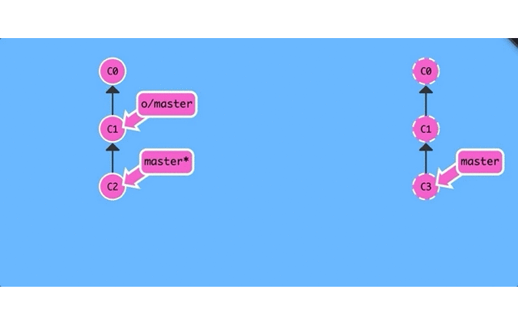

# 本地和远程仓库的本质

**本地仓库**和**远程仓库**在本质上没有太大区别,只不过一个是本地电脑,一个是远程电脑.

远程仓库不一定非得是 `github` 那种专门的"中央服务器",甚至局域网的另外一台电脑也可以充当"中央服务器"的角色,因为它存在的最初目的只是方便大家**交换彼此的提交记录**而已!

所以本地仓库和远程仓库的基本行为应该是一致的,约定俗成的规定是远程仓库一般不直接参与日常开发工作,主要作为项目托管中心.

> 某些自动化持续集成环境中也可能会直接操作远程仓库,这时远程仓库就真的和本地仓库没什么区别了!

## 个人开发常用命令

个人开发看重的是**效率**,顺便兼顾下**版本控制**则是锦上添花,`git` 的本地仓库充当的就是本地备份功能,远程仓库则是网盘备份.

### `git init` : 初始化本地项目

将本地项目初始化 `git` 项目,直观表现是在该项目同级目录下多了 `.git` 隐藏目录,其存储着 `git` 版本库相关信息.

> 此后当前项目便具备了本地管理的能力,可以与 `git` 进行交互.

### `git clone` : 克隆远程项目

同 `git init` 一样的作用,也是创建本地仓库,只不过 `git init` 是直接将本地项目作为本地仓库,而`git clone` 是将远程项目克隆到本地并作为本地仓库.

> 由此可见,`git clone` 比 `git init` 多了一层远程仓库的概念.

### `git add` : 添加文件

将工作区的提交记录添加到暂存区,暂存区是工作区和版本库交互的桥梁,暂存区积累到一定量的提交记录时就可以批量提交到版本库,有点像缓存的作用.      

### `git commit` : 提交文件

将暂存区的提交记录提交到版本库,从而形成**工作区->暂存区->版本库**的完整链路,本地工作区的版本控制流程基本结束.

### `git push` : 推送文件

如果是使用 `git clone` 命令克隆的本地项目,当工作到一定程度时可能需要将这部分工作成果推送到远程仓库,这时候使用 `git push` 命令完成本地版本的推送流程.

如果是使用 `git init` 命令初始化的本地项目,可能没有远程仓库,自然也就不需要推送.如果后来创建了远程仓库,那么你自然是想要将本地仓库推送到远程仓库的,因此你需要准确告诉 `git` 你要推送到远程仓库,使用 `git remote add origin git@github.com:username/repos.git` 命令添加远程仓库信息,建立了远程仓库的关联后就可以正常推送到远程仓库了.

## 团队开发常用命令

团队开发注重的不仅是个人效率还有团队的整体进度,随着企业级开发的日趋复杂化,不再是一个人能够独立完成的,更何况时间也不允许慢慢完成,大多数公司采用的是人力换时间的方式,团队并行开发来缩短整个项目周期,这种复杂需求下正是 `git` 大展拳脚的好机会.

项目整体采用并行开发模式,拆解成不同的功能模块,每个人负责各自模块,模块之间相对独立但也不排除存在交集的可能性,对于每一个个体开发者来说,既需要版本控制又需要团队交流.这时候分支的作用就凸显出来了,项目拆解成不同的功能模块,这些功能模块分别代表不同的分支,而这些功能模块整体组成了完整的项目,因此需要专门的分支来表示组装的过程,这样一来整个项目结构就很清晰了.

> 初始时项目是一个整体,中间拆解成不同功能模块,最后再合并成一个整体.  

### `git branch <branch>` : 创建本地分支

每一个独立的功能模块被定义成一个分支,创建分支的过程其实是拆解项目的过程,使用`git branch <branch>` 创建本地分支,在本地分支山专门开发特有的功能,不关心其他功能分支.

### `git checkout <branch>` : 切换本地分支

模块拆解完成后,创建了相应的分支,作为团队一员各自负责各自的工作,切换到约定好的分支上开展工作.

### `git merge <branch>` : 合并本地分支 

没有绝对的独立,项目再怎么拆分也是整体的一部分,肯定需要和其他功能模块发生关系,`git merge` 允许将其他分支的工作成果合并到自己的本地仓库中,这样完成一次小规模的组装过程,可以预期的是,当这种组装过程足够得多,收集了很多不同的功能后就能变成庞然大物!

### `git fetch` : 抓取远程分支

合并目标分支首先需要能够获取到目标分支的提交记录,既然每个功能模块都是不同的项目成员负责开发的,那自然不在我们自己的电脑上,所以我们先要将目标分支下载到我们本地,然后才能合并分支.

既然只是下载其他人的分支到我们的本地仓库,那我们完全可以给出目标分支的坐标,从而精确定位再下载到本地即可.所以 `git fetch` 理应支持这种方式,并不是只能从"中央服务器"的远程仓库下载.

### `git pull` : 拉取远程分支

先下载目标分支再合并到本地分支,从而小规模组成更复杂更强大的功能,每一次的组装过程都需要两步操作者显然不符合懒人思维,`git pull` 就是这两步操作的简化命令,先下载再合并就是这么简单!

## 远程仓库到底做了什么

不论是个人开发流程还是团队开发流程,我们都是站在主动方的角度思考问题,当远程仓库接收到我们的`git push` 或 `git pull` 请求时到底做了什么?

远程仓库(远程电脑上的本地仓库)只是众多分布式电脑上本地仓库中的一员,说它特殊也很特殊,充当着"中央服务器"作用,其余人统一从这里下载或推送;说它普通也很普通,和本地电脑上的本地仓库没有什么不同,随时可被替换成另外的电脑!

解开远程仓库的神秘面纱后,我们只需要将其视为普通的本地仓库一样对待即可,而我们本地电脑上已经有了本地仓库,故而需要将远程仓库做一下简单标识区分(`origin`).

- 先说说 `git pull` 命令发生了什么?

  1. 对于远程来说,接收到本地的下载请求时因为没有版本需要处理,所以无需任何操作.
  2. 对于本地来说,当远程仓库的相应分支下载到本地时应该更新远程分支状态,再尝试合并到本地的相应分支.

`git pull` 命令或者说是 `git fetch` 命令是本地和远程通信的方式,每次的通信都会被本地仓库的远程分支记录下来,作为远程仓库最新状态的凭证,因此 `origin/master` 会自动更新!

- 再讲讲 `git push` 命令做了什么?

  1. 对于本地来说,`git` 将本地仓库的指定分支推送到远程仓库的相应分支,同时更新了本地仓库的远程分支.
  2. 对于远程来说,`git` 接收到本地仓库的推送请求时应该在相应分支上合并本地分支,同时更新远程仓库的相应分支.

只要本地的指定分支成功推送到远程的相应分支时,对于本地来说,不论是指定分支还是远程分支(`origin/master`)都应该是最新状态,因为已经与服务器同步了.

而远程接收到此次推送请求时,应该尝试合并此次推送请求,再更新自己的相应分支,远程合并完成后才通知告知本地此时推送结果,如此一来,三端同步,皆大欢喜!

## 小结

本地仓库和远程仓库本质上没有太大区别, `git fetch` 是本地仓库和远程仓库之间的通信途径,本地仓库中的远程分支(`origin/master`)保存着最后一次通信状态.

