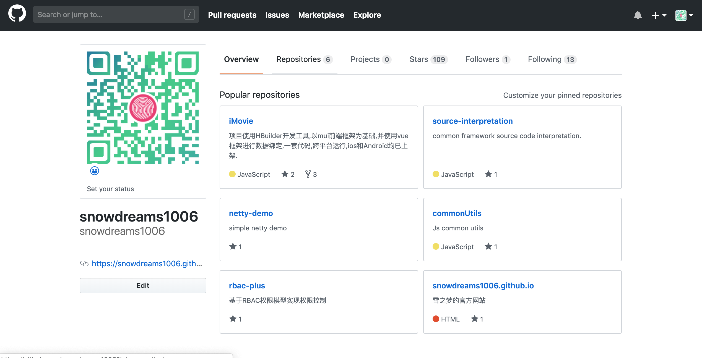

# markdown 快速入门 

`markdown` 不止是 `HTML` 的简化版,更重要的是 `txt` 的升级版,`word` 的轻量版,是笔记的最佳载体.

`markdown` 作为一种简单的格式标记语言,不同于 `txt` 的无格式,不同于 `HTML` 的复杂标记,也不同于 `word` 的鼠标调整样式.
`markdown` 通过简单的几个字符键入,就可以快捷的定义文档的样式.

掌握 `markdown`,你可以完全抛弃 `txt` 和笔记软件的编辑器,并且在大多数场景下替代掉复杂臃肿的 `word`.享受简洁之美、享受效率提升.

下面列举了 `markdown` 语法及对应的示例：

## 标题
在标题文字前面加`#`,并且加上空格分割.
一个`#`是一级标题,两个`#`是两级标题,以此类推,最多支持六级标题.

示例:

```
# 标题1
## 标题2
### 标题3
#### 标题4
##### 标题5
###### 标题6
```

效果:

# 标题1
## 标题2
### 标题3
#### 标题4
##### 标题5
###### 标题6

## 列表
包括有序列表和无序列表,支持列表嵌套.

### 有序列表 
有序列表就是有顺序的列表,依靠行前的数字加`.`标记顺序,序号和内容之间以空格` `分开.

示例:

```
1. 有序列表1 
2. 有序列表2 
3. 有序列表3 
```

效果:

1. 有序列表1 
2. 有序列表2 
3. 有序列表3 

### 无序列表 
无序列表就是列表不排序,支持`-` `*` `+` 3种前缀,可用于表示1级列表,2级列表,3级列表.

示例:

```
- 无序列表1 
* 无序列表2 
+ 无序列表3 
```

效果:

- 无序列表1 
* 无序列表2 
+ 无序列表3 

### 列表嵌套
上一级和下一级列表之间空两个空格`  `即可表示列表嵌套.

示例:

```
- 无序列表1
  * 无序列表11
  * 无序列表12
  * 无序列表13
    + 无序列表131
    + 无序列表132
    + 无序列表133
- 无序列表2
- 无序列表3 
```

效果:

- 无序列表1
  * 无序列表11
  * 无序列表12
  * 无序列表13
    + 无序列表131
    + 无序列表132
    + 无序列表133
- 无序列表2
- 无序列表3 

## 引用
在引用文字前加一个`>`即可,支持引用嵌套.

示例:

```
> 引用1
>> 引用11 
>>> 引用111
```

效果:

> 引用1
>> 引用11 
>>> 引用111

## 字体
### 粗体
要加粗的文字左右两边分别用两个 `*` 号或者 `_` 号包围起来

### 斜体
要倾斜的文字左右两边分别用一个 `*` 号或者 `_` 号包围起来

### 粗体+斜体
要加粗并倾斜的文字左右两边分别用三个 `*` 号或者 `_` 号包围起来

### 删除线
要删除的文字左右两边分别用两个 `~` 号包围起来

示例:

```
**粗体1**  __粗体2__

*斜体1*  _斜体2_

***粗体+斜体1***  ___粗体+斜体2___

~~删除线~~
```

效果:

**粗体1**  __粗体2__

*斜体1*  _斜体2_

***粗体+斜体1***  ___粗体+斜体2___

~~删除线~~

## 分割线
三个或三个以上的`-` `*`即可表示分割线

示例:

```
---
***
```

效果:

---
***

## 图片


其中,图片alt表示图片的解释文字,图片src是图片地址,支持本地路径和网络路径,图片title是图片的标题,可选.

示例:

```

```

效果:


## 超链接
[超链接text](超链接url "超链接title")

其中,超链接text表示超链接的解释文字,超链接url支持本地路径和网络路径,超链接title是超链接的标题,可选.

示例:

```
[https://snowdreams1006.github.io](https://snowdreams1006.github.io "snowdreams1006")
```

效果:

[https://snowdreams1006.github.io](https://snowdreams1006.github.io "snowdreams1006")

## 表格

- 第一行定义表头,单元格内定义标题;
- 第二行定义样式,单元格内部至少一个`-`,文字默认居左对齐,单元格内部`-`两侧均加`:`表示居中,只有右侧加`:`表示居右对齐;
- 第三行定义数据;

示例:

```
|默认居左|文字居中|文字居右|
|-|:-:|-:|
|居左对齐1|居中对齐1|居右对齐1|
|居左对齐2|居中对齐2|居右对齐2|
|居左对齐3|居中对齐3|居右对齐3|
```

效果:

|默认居左|文字居中|文字居右|
|-|:-:|-:|
|居左对齐1|居中对齐1|居右对齐1|
|居左对齐2|居中对齐2|居右对齐2|
|居左对齐3|居中对齐3|居右对齐3|

## 代码
### 单行代码
代码两侧分别用一个反引号包围起来

示例:

```
`code`
```
 
效果:

`code`

### 多行代码
代码块首尾分别用三个反引号包围起来,且两边的反引号独占一行

示例:

```
(```)
   function fun(){
     echo "这是一句非常牛逼的代码";
   }
   fun();
(```)
```

> 注：为了防止转译,前后三个反引号处加了小括号,实际是没有的.
 
效果:

``` 
function fun(){
  echo "这是一句非常牛逼的代码";
}
fun();
```

## 注释

示例:

```
<!--注释--> 
```

效果:

<!--注释--> 看不到***注释***就对了!


都学会了吗?

那考考你,你猜当前文档是如何书写的,看看你的答案和我实际书写规则是否一致呢!
>答案请参考[snowdreams1006.github.io](https://github.com/snowdreams1006/snowdreams1006.github.io)


