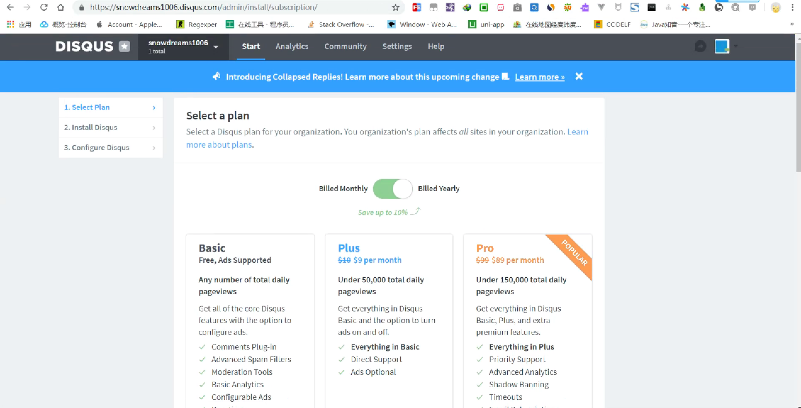
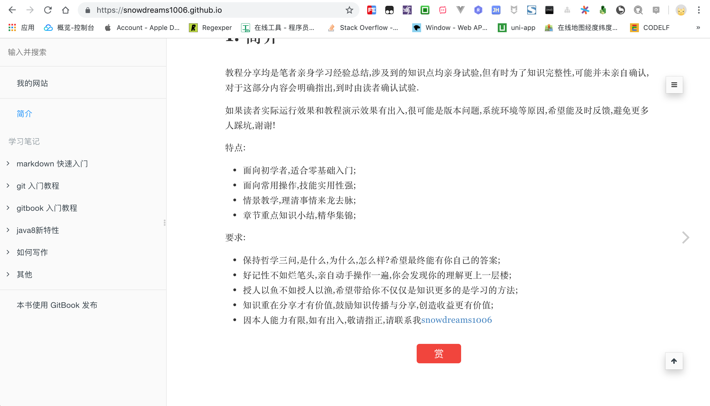
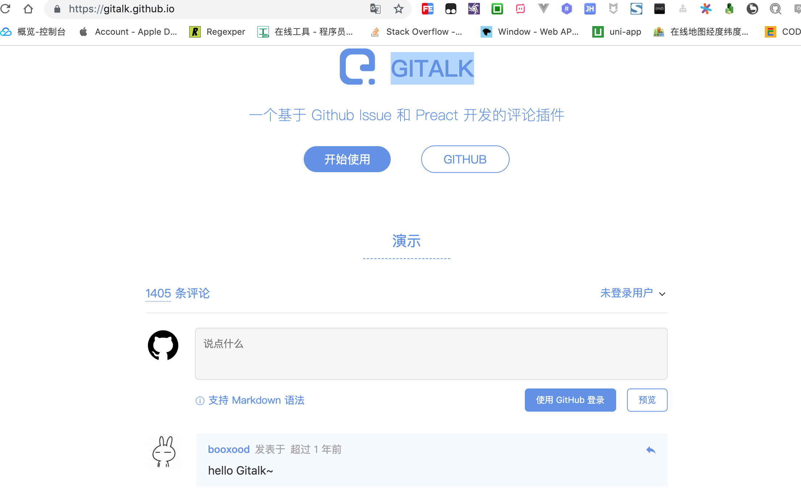
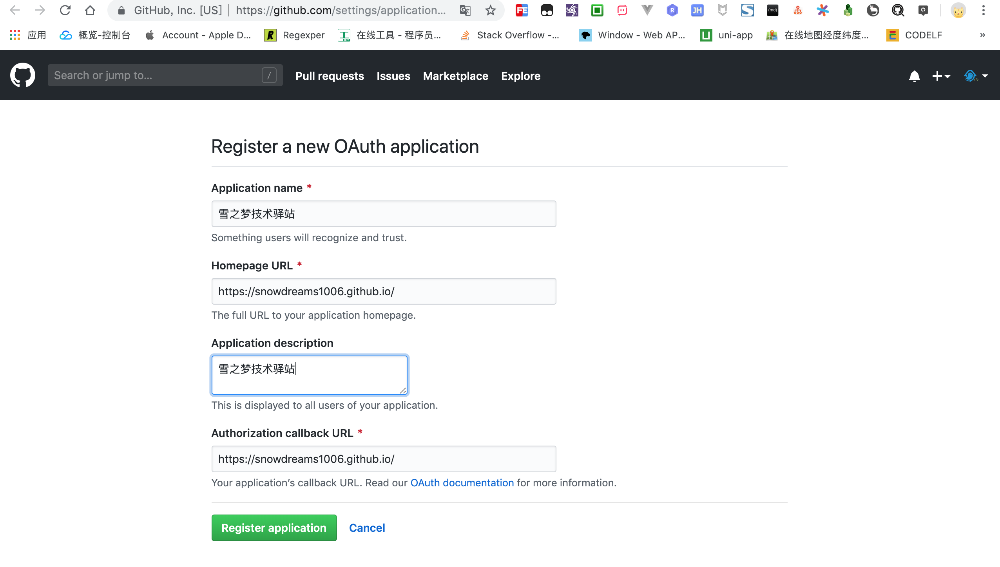
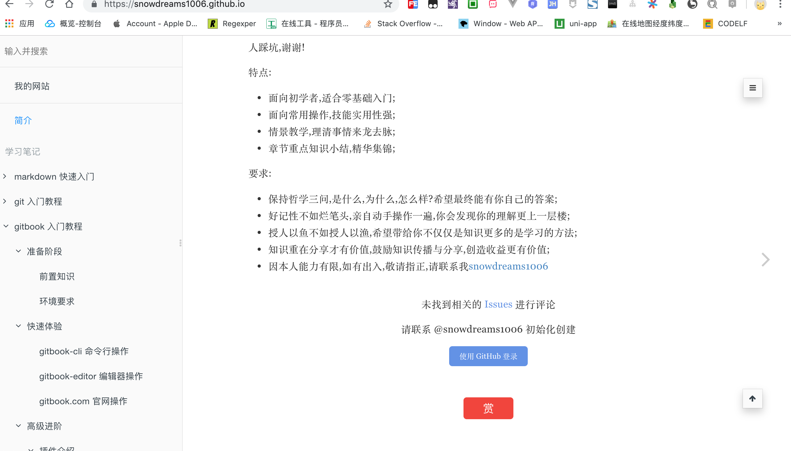
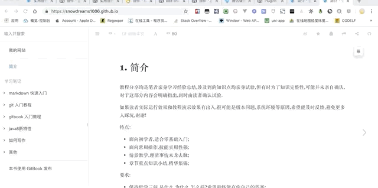
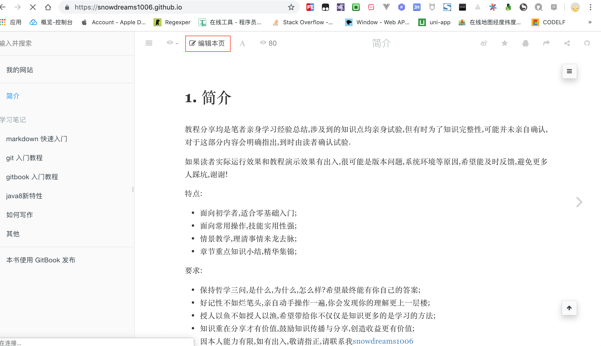

# 实用插件

<!-- toc -->

## `tbfed-pagefooter` 页脚插件

如果希望将网页源码暴露出去并接受公众的监督校准的话,使用[edit-link插件](https://plugins.gitbook.com/plugin/edit-link)可以直接链接到源码文件.

[链接地址](https://plugins.gitbook.com/plugin/tbfed-pagefooter): https://plugins.gitbook.com/plugin/tbfed-pagefooter


### 激活插件配置

在 `book.json` 中配置 `tbfed-pagefooter` 插件,详细说明请参考 [tbfed-pagefooter 插件](https://plugins.gitbook.com/plugin/tbfed-pagefooter).

示例:

```json
{
    "plugins": ["tbfed-pagefooter"],
    "pluginsConfig": {
        "tbfed-pagefooter": {
          "copyright":"&copy snowdreams1006",
          "modify_label": "文件修订时间：",
          "modify_format": "YYYY-MM-DD HH:mm:ss"
        }
    }
}
```

### 安装 `tbfed-pagefooter` 插件

示例:

```bash
$ gitbook install
```

### 测试 `tbfed-pagefooter` 插件

启动本地服务后,每个页面的页脚处都会自动生成版权信息以及当前文件的最后更新时间.

> 功能慎用: 如果文档频繁更新适合生成最后更新时间,如果长时间不更新文档,岂不是最后更新时间还是几年前,给读者的感觉像是不再维护了一样!

示例:

```bash
$ gitbook serve
```


## `disqus` 评论插件

[discus](https://disqus.com/) 是一款集成**评论**的插件,可以为静态网站添加动态评论,让你的网站动起来!


> 遗憾的是,`discus` 插件只有 FQ 才能正常使用,暂时没找到其他较好的替代方案.

### 注册 `disqus.com` 账号

`gitbook` 集成 `disqus` 插件中最重要的配置项就是注册 `disqus.com` 网站唯一标识.


#### 注册并绑定域名

如果没有注册账号请先注册,否则直接登录,当然也支持第三方账号登录(我使用的是谷歌账号).


> 人机验证时,选出符合条件的全部图形,直到没有新的图形为止,这一点和国内的静态图片验证是不同的!

选择安装 `disqus` 插件(`I want to install Disqus on my site `),接下来会绑定集成网站的域名.


接下来设置网站的相关信息,其中**网站名称**(`snodreams1006`)是唯一标示,接下来集成到 `gitbook` 用的就是这个简短名称,而分类和语言按照实际情况选择即可.


#### 选择服务类型

`disqus` 网站提供的服务类型,有基础班(`basic`),加强版(`plus`),专业版(`pro`)和免费版(`free`).

每个版本计划有不同的收费标准以及相应的服务,可以根据实际情况选择适合自己的服务类型.



接下来以免费版为例进行有关演示


#### 安装并配置 `disqus` 到网站

估计是这些网站提供了默认的集成方式,这里并没看到 `gitbook` 相关的网站,因此选择最后一个自定义网站.


填写网站的基本信息,其中网站缩写名称仍然是 `snowdreams1006`,网址填写 `https://snowdreams1006.github.io/` ,至于其他信息根据实际情况填写即可.


至此 `disqus.com` 网站配置完成,接下来我们配置 `gitbook` 集成 `disqus` 插件.


### 安装并配置 `disqus` 插件

上一步我们已经获取到唯一的标识: `snowdreams1006` ,接下来可以继续配置 `disqus`  插件了.

[链接地址](https://plugins.gitbook.com/plugin/disqus): https://plugins.gitbook.com/plugin/disqus 

#### 激活插件配置

在 `book.json` 中配置 `disqus` 插件,根据实际情况修改成自己的缩写名称(`shortName`).

示例:

```json
{
    "plugins": ["disqus"],
    "pluginsConfig": {
        "disqus": {
            "shortName": "snowdreams1006"
        }
    }
}
```

#### 安装 `disqus` 插件

示例:

```bash
$ gitbook install
```

#### 测试 `disqus` 插件

示例:

```
$ gitbook serve
```

正常情况下(FQ),`disqus` 插件已经成功集成到 `gitbook` 网站了,因此推送到实际服务器上时看到的效果是这样的.


如果你不具备条件(FQ),那么你看到的仍然是这样的.



## `gitalk` 评论插件

本篇文章发表在[开源中国](https://my.oschina.net/snowdreams1006/blog/3033074)后得到网友 [@八一菜刀](https://my.oschina.net/u/254762) 的评论,让我推荐了`gitalk` 评论插件,初始使用了一下,确实不错,因此在这里更新下.

上述 `disqus` 评论插件虽然比较好用,但是注册是在 `disqus.com` 官网,需要特殊手段才能访问,即便成功配置了国内一般也是访问不到的,因此功能相当鸡肋.

`gitalk` 评论插件解决了这一痛点,利用 `github` 的开发者接口授权,将讨论区的 `issue` 变成评论区,和 `github` 结合的如此紧密,适合用源码托管到 `github` 这类情况.

先混个脸熟,看一下 [gitalk 官网](https://gitalk.github.io/) 是如何介绍自己的呢.



看着效果确实不错,并且评论区的内容直接作为 `github` 仓库的 `issue`,这么好的想法我咋没想到呢!

好了,现在让我们开始集成到我们自己的项目中,遇到新鲜事物,当然先要参考官网介绍了.

### 申请 GitHub Application 授权

登录 `github` 账号,点击 [在线申请](https://github.com/settings/applications/new) 授权应用.

看到这一步,想必读者已经有个大概印象了,`gitalk` 插件是利用 `github` 的开发者服务,进行授权进而调用 `issue` 相关接口从而显示评论功能.

这种由官网提供的开发者服务还是比较好的,至少感觉比手动模拟提交要靠谱些,更何况走的是 `OAuth` 授权模式.

比如第三方应用提供微信登录,走的也是 `OAuth` 协议,这里的第三方应用当然就是现在说的 `Gitalk`
插件,微信就是我们的 `github` .

新建应用,首页 url 和授权回调 url 填写相同的首页链接即可,其他情况自定义填写.



应用登记成功后会生成 `token` 令牌,`clientId` 和 `clientSecret` 需要重点保存下来,待会需要用到.


### 安装并集成到网站

在需要添加评论的页面,添加下述内容引入 `gitalk` 插件,其中参数来自我们上一步获取的 `clientId` 和 `clientSecret` .

> 默认应该添加到 `.html` 页面,当然也可以添加到 `.md` 页面,毕竟 `markdown` 语法也支持 `html` 标签.

```
<link rel="stylesheet" href="https://cdn.jsdelivr.net/npm/gitalk@1/dist/gitalk.css">
<script src="https://cdn.jsdelivr.net/npm/gitalk@1/dist/gitalk.min.js"></script>
<div id="gitalk-container"></div>
var gitalk = new Gitalk({
  "clientID": "clientId",
  "clientSecret": "clientSecret",
  "repo": "GitHub repo",
  "owner": "GitHub repo owner",
  "admin": ["GitHub repo admin"],
  "id": location.pathname,      
  "distractionFreeMode": false  
});
gitalk.render("gitalk-container");
```

稍微解释下参数的含义:

- `"clientID"` : [必选] `GitHub Application Client ID`
- `"clientSecret"` : [必选] `GitHub Application Client Secret`
- `"repo"` : [必选] `GitHub repository`
- `"owner"` : [必选] `GitHub repository` 所有者，可以是个人或者组织
- `"admin"` : [必选] `GitHub repository` 的所有者和合作者 (对这个 `repository`有写权限的用户)
- `"id"` : [可选] 页面的唯一标识,默认值: `location.href`, 长度**必须小于50**,否则会报错!
- `"distractionFreeMode"`: [可选] 类似 `Facebook` 评论框的全屏遮罩效果,默认值: `false`

> 上述配置只是最简配置,如果想要了解更多高级配置,请参考 [官方文档](https://github.com/gitalk/gitalk#install)

### 测试集成效果

按照上述安装步骤,将代码复制到首页(`README.md`)文件中,然后推送到 `github` ,体验下集成效果.

> 注意: 这里必须推送到服务器,因为申请应用时填写的域名是线上地址,因而本地测试是不会成功的,会报错,这一点和微信支付的回调地址类似.

示例:

```
<link rel="stylesheet" href="https://cdn.jsdelivr.net/npm/gitalk@1/dist/gitalk.css">
<script src="https://cdn.jsdelivr.net/npm/gitalk@1/dist/gitalk.min.js"></script>
<div id="gitalk-container"></div>
var gitalk = new Gitalk({
  "clientID": "3f62415a283d19cbd696",
  "clientSecret": "aed0e1db0620bf5d0e3a3f0225f801997ad74e58",
  "repo": "snowdreams1006.github.io",
  "owner": "snowdreams1006",
  "admin": ["snowdreams1006"],
  "id": location.pathname,      
  "distractionFreeMode": false  
});
gitalk.render("gitalk-container");
```

> 上述参数仅供参考,实际使用中请替换成自己的配置,不然你也没有我仓库的权限,肯定会报错的啊!



心心相念的 `gitalk` 评论区呢?是不是哪里配置错了,为啥没有出来?

别急,要淡定,看一下提示说"未找到的 `Issue` 进行评论,请联系 @snowdreams1006 初始化创建",既然如此,那我们就操作一下吧!

点击下方的按钮 `使用 Github登录` ,会跳转到相应的仓库,然后按照提示确定.

再次返回首页,刷新一下看看发生什么神奇的事情了?


终于集成了评论功能,而且还支持 `markdown` 格式的评论呢!

### 进一步思考

确实不错,心中自然是欣喜万分,但别高兴太早了,因为你会发现其他页面并没有评论区,也很好理解,我们目前仅仅在首页(`README.md`) 集成了 `gitalk` 插件,也就是说使用 `gitbook build` 输出的 `index.html` 首页才支持评论区,其他页面没有插入上述代码,自然是没有评论区功能的啊!

那如果想要实现全网站的所有页面都集成评论区功能,应该怎么办呢?

百度搜索了一下,并没有找到优雅的解决方案,如果有人能够提供更好的解决方案,还望不吝赐教,在此谢过.

既然网上找不到优雅的解决方案,那寻求专业人士的帮助也是一种好办法,我去哪找 `gitalk` 的使用者呢?

聪明的你或许已经想到了,解铃还须系铃人,当然是向推荐给我插件的大牛提问了!

他确实提供了一种思路,以下是网友[@八一菜刀](https://my.oschina.net/u/254762)原话:

> 文档里面我用的是tbfed-pagefooter插件，不过我是在本地使用gitbook install后重写了该插件的js，无非就是在js里面加一段Gitalk的调用代码，这样使用gitbook build命令的时候，所有的页面都会有Gitalk的评论调用

人家既然已经提供了思路,不太好意思继续麻烦人家要源码,既然如此,那就自己动手吧!

`tbfed-pagefooter` 插件很熟悉,一般是用于注明版权以及文章的修订时间的,而且作用于每个页面,这一点就满足了集成 `gitalk` 相关代码的基本要求.

大体方向确定后,目前就是解决如何在 `tbfed-pagefooter` 插件构建的相关生命周期内顺便执行我们的代码?

正常当前项目安装 `tbfed-pagefooter` 插件后应该存放于 `/node_modules/gitbook-plugin-tbfed-pagefooter` 目录,大致看一下插件的项目结构.

```
gitbook-plugin-tbfed-pagefooter
├── LICENSE
├── README.md
├── assets
│   └── footer.css
├── index.js
└── package.json

1 directory, 5 files
$ 
```

为了基本看懂项目文件作用,特意去看了下 [gitbook 插件开发文档](https://toolchain.gitbook.com/plugins/),目标锁定在 `index.js` .

截取重要片段,原来是电子书构建前动态增加了 `html` 片段啊,这就好办了!

```
hooks: {
    'page:before': function(page) {
      var _label = '最后更新时间: ',
          _format = 'YYYY-MM-DD',
          _copy = 'powered by snowdreams1006'
      if(this.options.pluginsConfig['tbfed-pagefooter']) {
        _label = this.options.pluginsConfig['tbfed-pagefooter']['modify_label'] || _label;
        _format = this.options.pluginsConfig['tbfed-pagefooter']['modify_format'] || _format;

        var _c = this.options.pluginsConfig['tbfed-pagefooter']['copyright'];
        _copy = _c ? _c + ' all right reserved，' + _copy : _copy;
      }
      var _copy = '<span class="copyright">'+_copy+'</span>';
      var str = ' \n\n<footer class="page-footer">' + _copy +
        '<span class="footer-modification">' +
        _label +
        '\n{{file.mtime | date("' + _format +
        '")}}\n</span></footer>';

      str += '\n\n<link rel="stylesheet" href="https://unpkg.com/gitalk/dist/gitalk.css">'+
      '\n\n<script src="https://unpkg.com/gitalk@latest/dist/gitalk.min.js"></script>'+
      '\n\n<div id="gitalk-container"></div>'+
      '\n\n<script src="https://snowdreams1006.github.io/gitalk-config.js"></script>';

      page.content = page.content + str;
      return page;
    }
}
```

看懂基本原理后顺便修改了版权说明以及修订时间格式,然后追加了集成 `gitalk` 的相关代码.

> 这里为了方便修改 `gitalk` 配置,特意将相关配置项单独托管到 `github` 专门的 `gitalk-config.js` 文件.

至于配置文件的内容,并没什么特殊之处,还是顺便贴一下吧!

```
var gitalk = new Gitalk({
  "clientID": "3f62415a283d19cbd696",
  "clientSecret": "aed0e1db0620bf5d0e3a3f0225f801997ad74e58",
  "repo": "snowdreams1006.github.io",
  "owner": "snowdreams1006",
  "admin": ["snowdreams1006"],
  "id": window.location.pathname,
  "distractionFreeMode": false
});
gitalk.render("gitalk-container");
```

至此,之后再本地构建电子书时(`gitbook build`),`gitbook-plugin-tbfed-pagefooter` 自然会顺便帮我们运行集成 `gitalk` 的相关代码,这才是相对来说比较优雅的做法.

> 当然也不一定非要借助 `gitbook-plugin-tbfed-pagefooter` 插件帮忙,也可以借助别的插件进行集成,甚至自己写个更好的插件.

### 小结

`gitalk` 插件相对 `disqus` 插件来说,更符合基本国情,只不过默认的集成方式只能一个页面一个页面去集成,当数量比较多时,工作量不敢想象.

因此,通过 `gitbook` 插件开发的方式,在源码文件输出为目标文件时加入相关集成代码,相当于手写100条输出语句和循环写100条输出语句.

其实本质上并没有改变什么,仍然是集成到每个页面中,但是简化了人工操作的工作量就是效率的提升.

如果有更高效更优雅的集成方式,欢迎大家一起探讨.

## `mygitalk` 评论插件

如果你正在苦恼于 `Gitbook` 静态博客无法添加动态交互功能,如果你渴望接收用户的评论反馈,如果你看过 `gitalk` 插件却苦于没有现成的 `Gitbook` 插件,那么 `mygitalk` 插件值得一试!

[链接地址](https://www.npmjs.com/package/gitbook-plugin-mygitalk): https://snowdreams1006.github.io/gitbook-plugin-mygitalk/


> `gitbook-plugin-mygitalk` 是全网最早发布的基于 `gitalk` 实现评论插件,用于给 `Gitbook` 博客网站集成评论功能.

### 激活插件配置

在 `book.json` 中配置 `mygitalk` 插件,详细说明请参考 [mygitalk 插件](https://snowdreams1006.github.io/gitbook-plugin-mygitalk/).

示例:

```json
{
  "plugins" : ["mygitalk"],
  "pluginsConfig": {
    "mygitalk": {
        "clientID": "GitHub Application Client ID",
        "clientSecret": "GitHub Application Client Secret",
        "repo": "GitHub repo",
        "owner": "GitHub repo owner",
        "admin": ["GitHub repo owner and collaborators, only these guys can initialize github issues"],
        "distractionFreeMode": false
    }
  }
}
```

### 安装 `mygitalk` 插件

示例:

```
$ gitbook install
```

### 测试 `mygitalk` 插件

启动本地服务器后可能会提示联系管理员,只需要 `gitbook build` 上传到目标服务器上即可正常开启评论功能.

示例:

```
$ gitbook serve
```


## `copyright` 版权保护插件

如果你的博客不希望被别人随意转载或者文章希望保留首发网站信息,那么推荐使用[copyright插件](https://www.npmjs.com/package/gitbook-plugin-copyright)帮助你进行版权保护.

[链接地址](https://www.npmjs.com/package/gitbook-plugin-copyright): https://snowdreams1006.github.io/gitbook-plugin-copyright/


> `gitbook-plugin-copyright` 版权保护插件实现复制文章时自动追加版权保护信息,并在文章结尾处追加来源信息.

### 激活插件配置

在 `book.json` 中配置 `copyright` 插件,详细说明请参考 [copyright 插件](https://snowdreams1006.github.io/gitbook-plugin-copyright/).

示例:

```json
{
    "plugins": ["copyright"],
    "pluginsConfig": {
        "copyright": {
        "site": "https://snowdreams1006.github.io/gitbook-plugin-copyright",
        "author": "雪之梦技术驿站",
        "website": "雪之梦技术驿站",
        "image": "https://snowdreams1006.github.io/snowdreams1006-wechat-open.png"
        }
    }
}
```

### 安装 `copyright` 插件

示例:

```
$ gitbook install
```

### 测试 `copyright` 插件

默认情况下,版权保护信息是英文,如果 `book.json` 配置文件中指定中文语言 `"language": "zh-hans"` 时,内容复制以及文章末尾均为中文.

示例:

```
$ gitbook serve
```


## `readmore` 阅读更多插件

如果 `Gitbook` 个人博客流量不错的话,可以考虑转化成公众号流量,`readmore` 插件是集成[OpenWrite](https://openwrite.cn/)提供引流工具,通过关注公众号解锁博客文章,实现粉丝转换!

[链接地址](https://www.npmjs.com/package/gitbook-plugin-readmore): https://snowdreams1006.github.io/gitbook-plugin-readmore/


### 激活插件配置

在 `book.json` 中配置 `readmore` 插件,详细说明请参考 [readmore 插件](https://snowdreams1006.github.io/gitbook-plugin-readmore/).

示例:

```json
{
    "plugins": ["readmore"],
    "pluginsConfig": {
        "readmore":{
            "blogId": "15702-1569305559839-744",
            "name": "雪之梦技术驿站",
            "qrcode": "https://snowdreams1006.github.io/snowdreams1006-wechat-public.jpeg",
            "keyword": "vip"
        }
    }
}
```

### 安装 `readmore` 插件

示例:

```
$ gitbook install
```

### 测试 `readmore` 插件

`readmore` 插件暂未验证绑定域名,本地测试也能正常运行,如果后续开启了域名验证,只有部署到线上服务器才能生效,这一点和 `mygitalk` 插件原理类似.

示例:

```
$ gitbook serve
```


## `github` 插件

添加 `github` 图标链接,方便直接跳转到 `github` 指定仓库.

[链接地址](https://plugins.gitbook.com/plugin/github): https://plugins.gitbook.com/plugin/github


### 激活插件配置

在 `book.json` 中配置 `github` 插件,详细说明请参考 [github 插件](https://plugins.gitbook.com/plugin/github).

示例:

```
{
    "plugins": ["github"],
    "pluginsConfig": {
        "github": {
          "url": "https://github.com/snowdreams1006/snowdreams1006.github.io"
        }
    }
}
```

### 安装 `github` 插件

示例:

```
$ gitbook install
```

### 测试 `github` 插件

示例:

```
$ gitbook serve
```


## `edit-link` 编辑链接插件

如果希望将网页源码暴露出去并接受公众的监督校准的话,使用[edit-link插件](https://plugins.gitbook.com/plugin/edit-link)可以直接链接到源码文件.

[链接地址](https://plugins.gitbook.com/plugin/edit-link): https://plugins.gitbook.com/plugin/edit-link



### 激活插件配置

在 `book.json` 中配置 `edit-link` 插件,详细说明请参考 [edit-link 插件](https://plugins.gitbook.com/plugin/edit-link).

示例:

```
{
    "plugins": ["edit-link"],
    "pluginsConfig": {
        "edit-link": {
          "base": "https://github.com/snowdreams1006/snowdreams1006.github.io/blob/master",
          "label": "编辑本页"
        }
    }
}
```

### 安装 `edit-link` 插件

示例:

```
$ gitbook install
```

### 测试 `edit-link` 插件

如果不能正常跳转到源码文件,多次试验后重新更改 `edit-link.base` 节点内容,重新 `gitbook serve` 即可正常跳转源码文件.

示例:

```
$ gitbook serve
```



## `github` 插件

添加 `github` 图标链接,方便直接跳转到 `github` 指定仓库.

[链接地址](https://plugins.gitbook.com/plugin/github): https://plugins.gitbook.com/plugin/github


### 激活插件配置

在 `book.json` 中配置 `github` 插件,详细说明请参考 [github 插件](https://plugins.gitbook.com/plugin/github).

示例:

```
{
    "plugins": ["github"],
    "pluginsConfig": {
        "github": {
          "url": "https://github.com/snowdreams1006/snowdreams1006.github.io"
        }
    }
}
```

### 安装 `github` 插件

示例:

```
$ gitbook install
```

### 测试 `github` 插件

示例:

```
$ gitbook serve
```


## `search-plus` 中文搜索插件

默认的 `search` 搜索插件是不支持中文搜索的,而 `search-plus` 则功能更强大些,两者不能共存,需要禁用或移除 `search` 插件.

[链接地址](https://plugins.gitbook.com/plugin/search-plus): https://plugins.gitbook.com/plugin/search-plus


### 激活插件配置

在 `book.json` 中配置 `github` 插件,详细说明请参考 [github 插件](https://plugins.gitbook.com/plugin/search-plus).

示例:

```
{
    "plugins": [
      "-lunr", 
      "-search", 
      "search-plus"
    ]
}
```

### 安装 `search-plus` 插件

示例:

```
$ gitbook install
```

### 测试 `search-plus` 插件

测试是否能够进行中文搜索,如果不能,请确保已移除默认的 `"lunr"` 和 `"search"` 插件.

示例:

```
$ gitbook serve
```


## `diff` 代码差异插件

在写教程文档时有时会遇到这种场景,需要将前后两次代码进行差异化展示,通常有两种做法,一种是 PS 截图标注好修改内容,另一种就是手动计算出差异性代码,然后使用 `diff` 代码块展示前后差异.

`diff` 插件采用的就是后一种方式,不同之处在于自动计算差异而非手动计算,同时支持多种方式来计算前后差异,下面是使用效果.

[链接地址](https://www.npmjs.com/package/gitbook-plugin-diff): https://snowdreams1006.github.io/gitbook-plugin-diff/


### 激活插件配置

在 `book.json` 中配置 `diff` 插件,详细说明请参考 [diff 插件](https://snowdreams1006.github.io/gitbook-plugin-diff/).

示例:

```json
{
    "plugins": ["diff"]
}
```

### 安装 `diff` 插件

示例:

```
$ gitbook install
```

### 测试 `diff` 插件

`diff` 插件采用自定义 tag 语法方式获取前后代码块从而计算出代码块差异,为了更好地计算出代码差异,建议使用时指定计算方式,常见的计算方式有以下几种:

- `diffChars`

> 逐字符比较,适合比较单词字符改动情况.

````markdown

```js
cat
```
```js
cap
```

````


```js
cat
```
```js
cap
```


- `diffWords`

> 逐单词比较,适合比较单行单词改动情况

````markdown

```bash
beep boop  
```
```bash
beep boob blah
```

````


```bash
beep boop  
```
```bash
beep boob blah
```


- `diffLines`

> 逐行比较,适合比较多行文本改动情况

````markdown

```bash
beep boop
the cat is palying with cap
what
```
```bash
beep boob blah
the cat is palying with cap
who
```

````


```bash
beep boop
the cat is palying with cap
what
```
```bash
beep boob blah
the cat is palying with cap
who
```


- `diffJson`

> `json` 对比,适合比较 `json` 对象改动情况

````markdown

```json
{
  "name": "gitbook-plugin-simple-mind-map",
  "version": "0.2.1",
  "description": "A gitBook plugin for generating and exporting mind map within markdown"
}
```
```json
{
  "name": "gitbook-plugin-diff",
  "version": "0.2.1",
  "description": "A gitbook plugin for showing the differences between the codes within markdown"
}
```

````


```json
{
  "name": "gitbook-plugin-simple-mind-map",
  "version": "0.2.1",
  "description": "A gitBook plugin for generating and exporting mind map within markdown"
}
```
```json
{
  "name": "gitbook-plugin-diff",
  "version": "0.2.1",
  "description": "A gitbook plugin for showing the differences between the codes within markdown"
}
```


- `diffArrays`

> 数组对比,适合比较数组对象改动情况

````markdown

```json
[
    "Vue",
    "Python",
    "Java",
    "flutter",
    "springboot",
    "docker",
    "React",
    "小程序"
]
```
```json
[
    "Vuejs",
    "Nodejs",
    "Java",
    "flutter",
    "springboot",
    "docker",
    "React"
]
```

````


```json
[
    "Vue",
    "Python",
    "Java",
    "flutter",
    "springboot",
    "docker",
    "React",
    "小程序"
]
```
```json
[
    "Vuejs",
    "Nodejs",
    "Java",
    "flutter",
    "springboot",
    "docker",
    "React"
]
```


示例:

```
$ gitbook serve
```


## 其余插件列表

- 外链视频 : [gitbook-plugin-chinese-video](https://www.npmjs.com/package/gitbook-plugin-chinese-video)
- 视频播放 : [gitbook-plugin-html5-video](https://www.npmjs.com/package/gitbook-plugin-html5-video)
- 音频播放 : [gitbook-plugin-audio_image](https://www.npmjs.com/package/gitbook-plugin-audio_image)