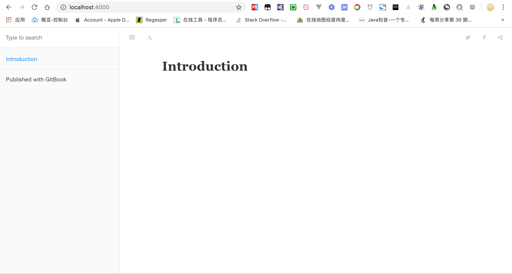
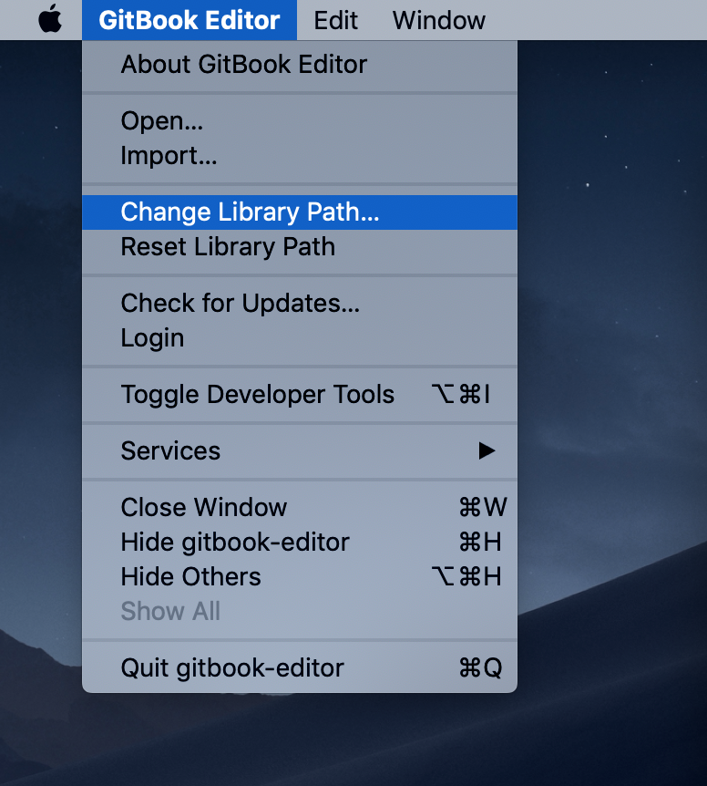
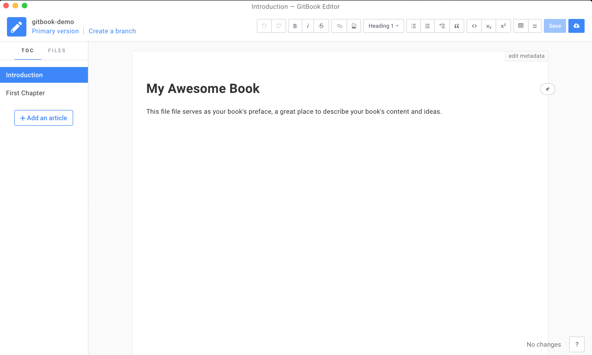

# 快速体验

本文主要介绍三种使用 `gitbook` 的方式,分别是 `gitbook` 命令行工具,`Gitbook Editor` 官方编辑器和 `gitbook.com` 官网.

总体来说,三种途径适合各自不同的人群,找到适合自己的方式就好,基本操作流程都是一样的.

- 命令行工具更适合具备编程经验开发者,具有简单高效易整合等特点.
- 编辑器更适合无任何编程经验的文学创作者,不熟悉 `markdown` 语法,不熟悉 `git` 工作流,这种情况下也推荐使用图形化操作的编辑器.
- 官网适合想要快速体验 `gitbook` 效果的萌新,只有觉得物超所值才能有动力搭建 `gitbook` 开发环境,不是吗?

> 当然,如果你想访问官网的话,你可能需要学会科学上网,网址见文章结尾.

## `gitbook` 命令行

首先需要创建存放书籍的目录,然后对该目录进行初始化,最后启动本地服务即可体验效果.

### 初始化项目

> 语法格式: `gitbook init`

如果是空目录会自动创建 `README.md` 和 `SUMMARY.md` 两个文件,当然也可以手动创建再初始化.

示例:

```
# 创建 `gitbook` 演示项目
$ mkdir gitbook-demo

# 初始化项目
$ gitbook init
warn: no summary file in this book 
info: create README.md 
info: create SUMMARY.md 
info: initialization is finished 

# 当前目录结构
$ tree 
.
├── README.md
└── SUMMARY.md

0 directories, 2 files
$ 
```

> `gitbook init` 命令可能会自动生成 `README.md` 和 `SUMMARY.md` 两个文件,如已存在则更新.

### 运行项目

> 语法格式: `gitbook serve`

将初始化后的项目启动成为一个本地服务,我们可以直接在浏览器访问项目,预览书籍效果.

示例:

```
# 启动本地服务器
$ gitbook serve
Live reload server started on port: 35729
Press CTRL+C to quit ...

info: 7 plugins are installed 
info: loading plugin "livereload"... OK 
info: loading plugin "highlight"... OK 
info: loading plugin "search"... OK 
info: loading plugin "lunr"... OK 
info: loading plugin "sharing"... OK 
info: loading plugin "fontsettings"... OK 
info: loading plugin "theme-default"... OK 
info: found 1 pages 
info: found 0 asset files 
info: >> generation finished with success in 1.2s ! 
```



如果要停止服务器,只需同时按住 `CTRL+C` 即可,现在再看一下 `gitbook-demo` 目录结构.

```
$ tree
.
├── README.md
├── SUMMARY.md
└── _book
    ├── gitbook
    │   ├── fonts
    │   │   └── fontawesome
    │   │       ├── FontAwesome.otf
    │   │       ├── fontawesome-webfont.eot
    │   │       ├── fontawesome-webfont.svg
    │   │       ├── fontawesome-webfont.ttf
    │   │       ├── fontawesome-webfont.woff
    │   │       └── fontawesome-webfont.woff2
    │   ├── gitbook-plugin-fontsettings
    │   │   ├── fontsettings.js
    │   │   └── website.css
    │   ├── gitbook-plugin-highlight
    │   │   ├── ebook.css
    │   │   └── website.css
    │   ├── gitbook-plugin-livereload
    │   │   └── plugin.js
    │   ├── gitbook-plugin-lunr
    │   │   ├── lunr.min.js
    │   │   └── search-lunr.js
    │   ├── gitbook-plugin-search
    │   │   ├── lunr.min.js
    │   │   ├── search-engine.js
    │   │   ├── search.css
    │   │   └── search.js
    │   ├── gitbook-plugin-sharing
    │   │   └── buttons.js
    │   ├── gitbook.js
    │   ├── images
    │   │   ├── apple-touch-icon-precomposed-152.png
    │   │   └── favicon.ico
    │   ├── style.css
    │   └── theme.js
    ├── index.html
    └── search_index.json

11 directories, 27 files
$ 
```

> `gitbook serve` 命令可能会自动生成 `_book` 目录,如已存在则更新.


## `gitbook editor` 编辑器

下载 [gitbook editor](https://legacy.gitbook.com/editor) 并安装,如果下载遇到困难,可以找我来帮忙哟!


> 如果你没有梯子,可以暂不登录(Do that Later),只不过无法与 `gitbook.com` 保持同步. 

### 更改图书路径

更改默认图书存放位置(`Gitbook Editor => Change Library Path...`),以后图书目录都在该目录下,比如设置的是 `.../gitbook-editor/` 图书目录.




### 新建图书

新建图书项目,名字仍然是 `gitbook-demo`,这样方便比较和命令行创建的 `gitbook-demo` 区别.



> 图形化操作界面总体来说还是很容易上手的,自己好好研究一下即可,这里仅仅演示默认效果.

### 启动项目

现在先找到新建图书的具体目录,然后再启动本地服务器,同样地,我们在浏览器中体验电子书效果.

> 图书项目路径: `/workspace/gitbook-editor/Import/gitbook-demo`,其中 `/workspace/gitbook-editor/` 是上一步更改的图书路径.

```
# 启动本地服务器
$ gitbook serve
```

> 这里不再需要运行 `gitbook init` 命令了,因为已经创建过 `README.md` 和 `SUMMARY.md` 这两个文件.
 


> `Gitbook Editor` 编辑器新建的图书项目和 `gitbook-cli` 创建的图书项目本质上并没有什么不同,只不过编辑器集成了常用功能而已!

## `gitbook.com` 网站 

由于受网络因素所限,暂时不分享这部分知识了,简单来说就是在线编辑并发布电子书,这一点和 `github` 的代码托管服务类似.

- [gitbook 新版官网(需要FQ)](https://www.gitbook.com/) : https://www.gitbook.com/
- [gitbook 旧版官网(无需FQ)](https://legacy.gitbook.com) : https://legacy.gitbook.com

## 小结

- 初始化项目 : `gitbook init`
- 启动项目 : `gitbook serve`
- 默认访问地址: `http://localhost:4000`

