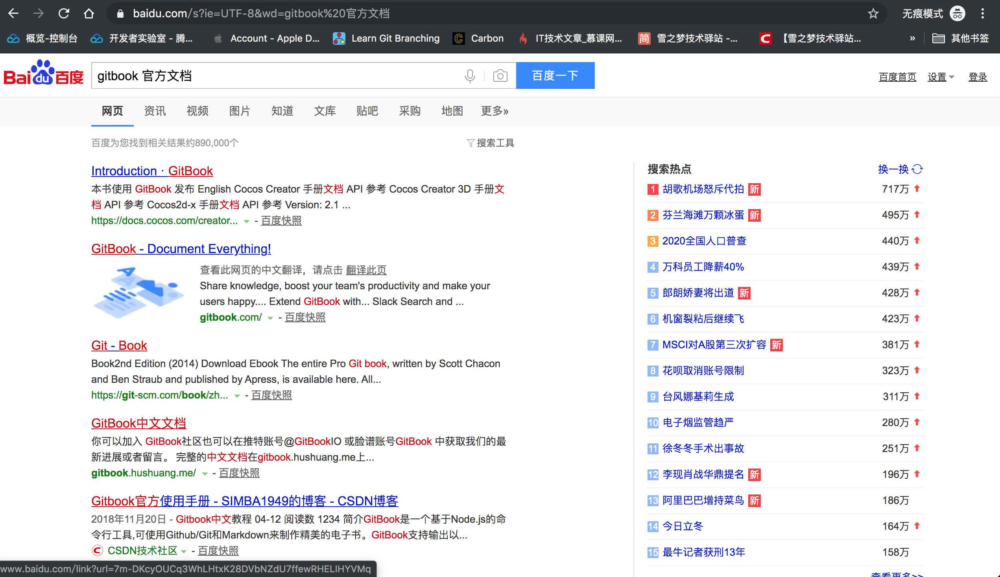
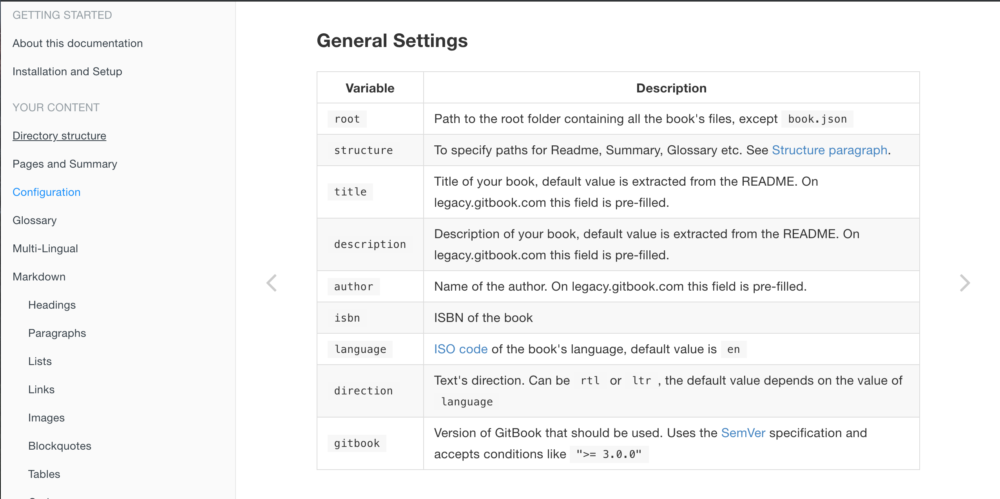
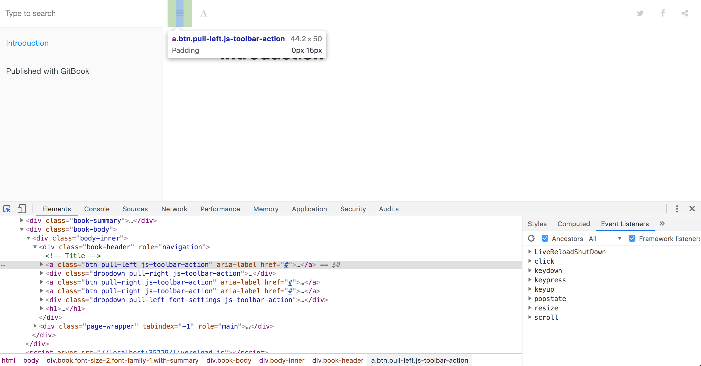

# 初始化默认折叠效果

## 善良的我总是有求必应

可能是网上关于 `gitbook` 的教程比较落后的原因吧,写文章初期做了不少关于gitbook系列教程,上个月有个好友问我能不能配置默认折叠的效果,心里有些犯难,作为 `gitbook` 的忠实粉丝,我都不知道 `gitbook` 有这方面的配置!

但是,善良的我总是有求必应,不忍心拒绝小白用户,于是我便抱着试一试的心态开始研究一下如何默认折叠?

当然,解决问题前还是要先复现一下问题,然后在命令行中熟练敲入了 `gitbook serve` 命令来启动本地服务器,为了排除缓存等影响,特意打开了 `Chrome` 浏览器的**无痕模式**,果不其然默认是展开的!


> 不能复现的问题都不是我的问题,拒绝解决此类问题,搞不好是你自己环境搭建问题呢!

## 寻找官方文档之路艰难

问题复现后就要开始寻求解决之道,虽然印象中并没有相关配置,但是难保记忆混乱遗漏了某些配置项,所以还是先看看官方文档怎么说的吧!

但是,当你在浏览器中输入 `gitbook` 时,并找不到官方文档而是新版官网,不信你自己去搜一下,肯定是新版官网.



当你自以为找到了官网时,点击进去查看文档部分,很遗憾,这是新版文档并不是老版文档,你还会继续百度一下寻求可用链接期待找到官方文档.


为了节省宝贵时间,这里推荐访问个人维护的 `gitbook` 文档,点击访问: [https://snowdreams1006.github.io/gitbook-official/](https://snowdreams1006.github.io/gitbook-official/)

目前提供了中英文两个语言版本的文档,相信可以满足大多数用户的需求了,选择任意一种语言后点击进入翻阅相关设置.


实际上,官方文档也并没有什么用,因为根本就没有提到过如何更改相关配置使其**默认折叠而非展开状态**.



> 官方不再维护旧版文档,费尽心机找到旧版文档也无济于事,并没有提及到相关配置,很可能并未提供有关配置项!

## 用一下搜索引擎又不会死

俗话说:互联网上绝大多数问题别人都已经遇到过并提供了解决方案,我们要做的就是找到它!

这也是面向搜索编程的核心思想,遇到默认折叠问题应该也不会例外,那就搜索一下吧!


虽然百度搜索出现了一些相关文章,但是却不是我们想要的效果,大多数是基于 `gitbook` 插件实现的目录折叠效果,并不是默认折叠左侧菜单效果.

不管是换关键词重新搜索还是谷歌搜索,均未发现有关默认折叠左侧菜单的解决方案,难不成面向搜索失败了,要做解决问题的第一人吗!


> 多次重复搜索操作均为找到解决方案,由此可见真的很少有人想要默认折叠左侧菜单,我也是很佩服提出该问题的小伙伴骨骼惊奇啊!

## 直面问题期待找到蛛丝马迹

既然依靠别人无法解决问题,那么只能自力更生独自解决问题,是时候考验真正的技术了!

为了排除无关干扰,不能再用自己的 `gitbook` 项目了,毕竟文件太多不方便后续调试,重新创建一个测试项目.

- 创建测试项目

```bash
$ mkdir test && cd test
```

- 初始化测试项目

```bash
$ gitbook init
```

- 启动测试项目

```bash
$ gitbook serve
```

虽然一片空白,并没有什么实质性内容,但是大道至简,对于我们复现并测试问题来说,足够了!


打开 `Chrome` 浏览器并按下 `F12` 开启调试模式,鼠标选中左侧的 `Elements` 元素选项卡并点亮左侧的小鼠标,然后在页面上找到左侧图标按钮,于是选中元素高亮了.



```html
<a class="btn pull-left js-toolbar-action" aria-label="" href="#"><i class="fa fa-align-justify"></i></a>
```

稍微熟悉前端的小伙伴可能很轻松就能明白 `a` 标签的 `class` 属性表示的含义,见名知意,可以这么解释:

- `btn` 应该是控制外观的样式,表现得像是按钮效果.
- `pull-left` 应该是控制元素的位置,拉倒左边.
- `js-toolbar-action` 应该是控制元素的行为,`js` 工具栏行为动作.

由此可见,点击该图标实现左侧菜单折叠/展开效果应该是 `.js-toolbar-action` 在起作用,也就是说某一段 `js` 肯定是针对该 `class` 进行了监听!


