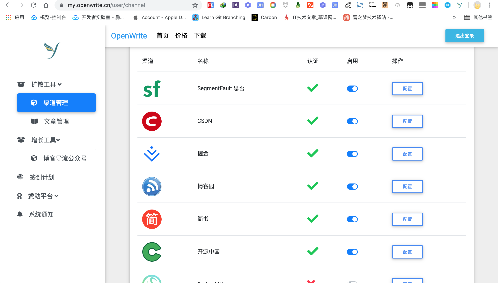

# 公众号引流

相信大多数博客作者都或多或少有过这样想法: 现在各种平台这么多,想要实现**全平台发布**就要到处**复制粘贴**,等我有空一定做**统一平台**一次性**全部解决**!

不知道正在阅读文章的你,有没有这样的想法?

反正我确实这么想过,甚至 `github` 上[相关项目](https://github.com/snowdreams1006/distribute-your-article)早已创建,**可一直迟迟没有下一步**,要么是工作忙,要么是技术储备不够,**总有一大堆借口自我安慰**!

如果只是专注于某一两家平台,这种需求可能不会那么强烈,可是如果你和我一样曾经手动复制粘贴过下面这么多平台,那么我相信你一定可以体会**一文多发的迫切性**!

[](https://github.com/snowdreams1006)
[](https://snowdreams1006.github.io/snowdreams1006-wechat-public.jpeg)
[](https://www.toutiao.com/c/user/86185341500/#mid=1624534658539532)
[](https://space.bilibili.com/236627025)
[](https://www.imooc.com/u/5224488/articles)
[](https://www.jianshu.com/u/577b0d76ab87)
[](https://snowdreams1006.blog.csdn.net/)
[](https://www.cnblogs.com/snowdreams1006/)
[](https://juejin.im/user/582d5cb667f356006331e586)
[](https://segmentfault.com/u/snowdreams1006)
[](https://my.oschina.net/snowdreams1006)
[](https://cloud.tencent.com/developer/user/2952369/activities)

幸运的是,在**一文多发**探索的路上并不孤单,不堪其扰的大佬们早已**说干就干动手解决**了这个问题,有的是**开源平台**,有的是 **`SAAS` 服务**,大家都在努力...

其中,`SAAS` 服务可能是最简单上手的方式了,这就是今天的主角: [`OpenWrite`](https://openwrite.cn/) 一文多发平台!

- 如果你热衷于写文**记录点滴**、**分享心得**
- 如果你钟情于 `markdown` 的**简洁**、流畅与纯粹
- 如果你专注于内容创作,而对很多**网络抄袭**无可奈何

那么,希望 [https://openwrite.cn/](https://openwrite.cn/) 可以帮助你！

## 一文多发

`OpenWrite` 提供的众多功能中最吸引我的地方莫过于**一文多发**功能了: 我在用的平台它都有,我没用的平台它也有!


还是熟悉的 `markdown` 编辑器,便捷的**自动认证**功能,发布文章再也不用**一处编辑,到处复制**了,顺便解决了一直令人困扰的**图片上传**问题.



> 目前已提供的平台中涵盖了绝大部分技术博客平台,相信以后会支持更多平台的吧,再也不用复制粘贴那么多次了呢!

平台整体上使用体验非常不错,大致步骤是先提前登陆各大目标平台,然后通过 `OpenWrite` 提供的插件自动进行渠道认证,配置各大渠道后就可以愉快发文啦!

稍微摸索下就能很快上手,在这里不再赘述了,不了解的小伙伴们可以看看 [技术文章博客，互联网运营平台 OpenWrite](https://openwrite.cn/openwrite/openwrite-1/)

## 公众号引流

如果你也有自己独立的博客,也在运营者自己的公众号,但是苦于没有很好的手段引导用户关注公众号,那么`Openwrite` 推出的 `ReadMore` 工具可以说是良心之作!

- 效果如何看了就知道

个人博客集成 `ReadMore` 工具后,博客文章的内容自动**隐藏**一半,同时浮现出**阅读全文**的按钮引导用户点击.


一旦用户想要阅读全文就会主动点击按钮,此时就会自动弹出引导用户关注公众号进行解锁文章的弹窗.


此时,用户有三种选择,要么扫码关注公众号解锁全站文章,要么掉头走人不再阅读,或者以其人之道还治其人之身,技术绕过直接解锁!

当然,我们自然是希望所有的阅读用户都能转换成公众号粉丝,所以接下来应该是关注公众号**回复关键字**获取验证码.


当用户点击公众号预先设置好的文字链接后,此时就会获取到验证码,离成功只差一步!


回到博客平台的受限文章,输入刚刚获取到的验证码,此时不仅解锁了当前文章,博客内的其他文章全部自动解锁,完美!


从**陌生读者**阅读博客文章到转换成**公众号粉丝**,整个操作流程一气呵成,没有丝毫卡顿也没有门槛,一切都是这么自然!

所以,如果你有**自主运营**的个人博客,想要转换成公众号粉丝,那么 `ReadMore` 工具简直就是**躺增粉丝**利器!

## 自主集成

`ReadMore` 工具集成步骤比较简单,按照官方说明,大致可以分为两步:

- 设置微信公众号

登录要增粉的微信公众号,按如下规则设置关键词回复:

关键词,设置为: vip
回复内容,设置为如下文本内容:
                        
```html
<a href="https://my.openwrite.cn/code/generate?blogId=15702-1569305559839-744">点击该链接，获取博客解锁验证码</a>
```

- 设置个人博客

在您博客的文章页面的末尾,增加如下js代码.

```js                        
<script src="https://my.openwrite.cn/js/readmore.js" type="text/javascript"></script>
<script>
    const btw = new BTWPlugin();
    btw.init({
        id: 'container',
        blogId: '15702-1569305559839-744',
        name: '雪之梦技术驿站',
        qrcode: 'https://snowdreams1006.github.io/snowdreams1006-wechat-public.jpeg',
        keyword: 'vip',
    });
</script>
```

> 其中id中设置的container需要用户根据文章页面中的文章容器来调整,或者直接将文章最外面的容器设置为该id.

然而,如果博客文章只有一篇,这么设置是没有问题的,但是博客肯定是不可能只有一篇文章的,所以该规则应该自动应用到全部文章中,如此一来,个人博客的全部文章都拥有该功能.

## `gitbook` 插件自动集成

熟悉了自主集成的基本思路后,不难发现,集成 `ReadMore` 工具只需要保证个人博客支持运行 `Js` 代码即可!

这个要求确实不高,`gitbook` 搭建的静态网站也支持运行 `Js` 代码的,更何况整合 `github` 后还提供了免费域名!

说干就干,于是乎,花了一整晚的时间弄了 `gitbook` 插件来集成 `ReadMore` 工具.

- 安装 `openwrite` 插件

在 `book.json` 配置文件中,添加 `openwrite` 插件到 `plugins` 数组中,参考示例如下:

```json
{
    "plugins" : ["openwrite"]
}
```

声明插件后添加插件配置项,配置信息来源于 `openwrite` 后台,务必修改成自己真正的配置信息!

```json
{
    "pluginsConfig":{
        "openwrite":{
            "blogId": "15702-1569305559839-744",
            "name": "雪之梦技术驿站",
            "qrcode": "https://snowdreams1006.github.io/snowdreams1006-wechat-public.jpeg",
            "keyword": "vip"
        }
    }
}
```

> 插件配置项仍然是 `book.json` 配置文件,`gitbook` 的插件声明和插件配置不是同一个节点而是独立声明的,所以务必填写插件配置信息.

插件声明并配置后,通过 `gitbook` 或 `npm` 命令行方式安装 `openwrite` 插件到本地.

```bash
$ gitbook install
```

或者

```bash
$ npm install gitbook-plugin-openwrite
```

- 运行 `openwrite` 插件

本地运行 `gitbook serve` 后验证下是否成功集成 `ReadMore` 功能吧!

如果没有问题的话,运行 `gitbook build` 生成网页文件准备上传到 `github` 或其他静态服务器吧!

## 集成思路参考

按照官网的工具集成指南,关于博客设置的部分只需要将自己的专属配置信息插入到博客的每一篇文章中即可实现.

但是,大多数博客平台编写技术文章时都是直接编写 `markdown` ,因而无法直接插入 `js`,比较方便的做法是修改全局性的模板文件.

关于 `gitbook` 的模板文件位于根目录下的 `_layouts/website/page.html` ,所以要么直接修改模板,要么通过插件方式自定义模板!

独乐乐不如众乐乐,本来打算直接修改 `gitbook` 模板文件,后来觉得这样配不上技术的身份,还是采用插件的方式扩展吧!

```html



<div id="vip-container">
    {{ page.content|safe }}
</div>



{{ super() }}
<script src="https://my.openwrite.cn/js/readmore.js" type="text/javascript"></script>
<script>
    const btw = new BTWPlugin();
    btw.init({
        "id": "vip-container",
        "blogId": "{{ config.pluginsConfig.openwrite.blogId }}",
        "name": "{{ config.pluginsConfig.openwrite.name }}",
        "qrcode": "{{ config.pluginsConfig.openwrite.qrcode }}",
        "keyword": "{{ config.pluginsConfig.openwrite.keyword }}"
    });
</script>

```

- 全局构建目标区域

```html

<div id="vip-container">
    {{ page.content|safe }}
</div>

```

`page.content` 是每个页面当前的文件内容,不再是原生的 `markdown` 类型而是 `html` 类型,这一点非常重要,因为 `gitbook` 并不会处理 `div` 内嵌的 `markdown` 内容!

> 之前一直在尝试想通过 `Js` 方式直接在当前文件内容外面嵌套一层目标区域 `div`,但是只找到 `markdown` 异步转 `html` 的 `api` 导致无法集成,最后只能采用修改模板的方式.

`{{ page.content|safe }}` 表示的是当前页面的 `html` 内容,在外面再嵌套一层 `div` ,其中 `id="vip-container"`.

- 全局插入到目标页面

```js
<script src="https://my.openwrite.cn/js/readmore.js" type="text/javascript"></script>
<script>
    const btw = new BTWPlugin();
    btw.init({
        "id": "vip-container",
        "blogId": "{{ config.pluginsConfig.openwrite.blogId }}",
        "name": "{{ config.pluginsConfig.openwrite.name }}",
        "qrcode": "{{ config.pluginsConfig.openwrite.qrcode }}",
        "keyword": "{{ config.pluginsConfig.openwrite.keyword }}"
    });
</script>
```

`{{ config.pluginsConfig.openwrite.blogId }}` 读取的是 `gitbook` 关于 `openwrite` 插件的配置信息,目标代码自动插入到每一个页面中,省去了手动插入的麻烦,做到了自动化集成的需求.

> 上一步全局构建的目标区域 `id="vip-container"` 在这一步直接使用了,所以该配置项不必暴露给用户.

- 使用者需要做啥

```json
{
    "title": "雪之梦技术驿站",
    "author": "snowdreams1006",
    "description": "雪之梦技术驿站又名snowdreams1006的技术小屋.主要分享个人的学习经验,一家之言,仅供参考.",
    "language": "zh-hans",
    "gitbook": "3.2.3",
    "plugins": [
        "openwrite"
    ],
    "pluginsConfig": {
        "openwrite":{
            "blogId": "15702-1569305559839-744",
            "name": "雪之梦技术驿站",
            "qrcode": "https://snowdreams1006.github.io/snowdreams1006-wechat-public.jpeg",
            "keyword": "vip"
        }
    }
}
```

虽然本教程基于 `gitbook` 提供的插件机制进行集成 `ReadMore` 功能,但是其他平台的思路大致上也是一样的,最方便的做法是基于模板固定目标区域,然后配置相应的 `Js` 代码.

当然,直接集成是非常简单的,如果是基于插件进行集成提供给更多人使用的话,那可能就要研究一下博客平台的接口文档了.

## 结尾与总结

总体来说,`Openwrite` 一文多发平台非常优秀,对于多平台发布的小伙伴来说更是福音,假如没有一文多发的需求,那可能对你的帮助并没有那么大.

但是,作为一个有追求的技术分享者,个人博客用户转换成微信公众号粉丝这一需求应该更加普遍,感谢 `Openwrite` 提供的 `ReadMore` 工具,原以为只有动态博客才能玩的套路没想到也可以用到静态博客身上!

基于 `Gitbook` 搭建的静态博客市面上并不少,考虑到其他小伙伴可能也有类似需求,所以做成了 `gitbook` 插件共享给大家,希望对大家有所帮助!

[](https://www.npmjs.com/package/gitbook-plugin-openwrite)
[](https://www.npmjs.com/package/gitbook-plugin-openwrite)
[](https://www.npmjs.com/package/gitbook-plugin-openwrite)
[](https://github.com/snowdreams1006)
[](https://snowdreams1006.github.io/snowdreams1006-wechat-public.jpeg)

- 项目地址: [https://github.com/snowdreams1006/gitbook-plugin-openwrite](https://github.com/snowdreams1006/gitbook-plugin-openwrite)
- 演示地址: [https://snowdreams1006.github.io/](https://snowdreams1006.github.io/)

## 参考链接

- [https://openwrite.cn/](https://openwrite.cn/)
- [还在搞公众号互推涨粉？OpenWrite推出增长神器，助你实现粉丝躺增！](https://openwrite.cn/openwrite/openwrite-readmore/)
- [WordPress 博客整合导流工具，博客导流到微信公众号](https://mp.weixin.qq.com/s/TkCB_y4-bfFpo6uHVV70bQ)
- [谈一谈博客的关注解锁文章功能](https://cuiqingcai.com/7463.html)
- [牛掰！我是这么把博客粉丝转到公众号的](https://mp.weixin.qq.com/s/5jYWz8H0_-qBKIr-vFzRNQ)