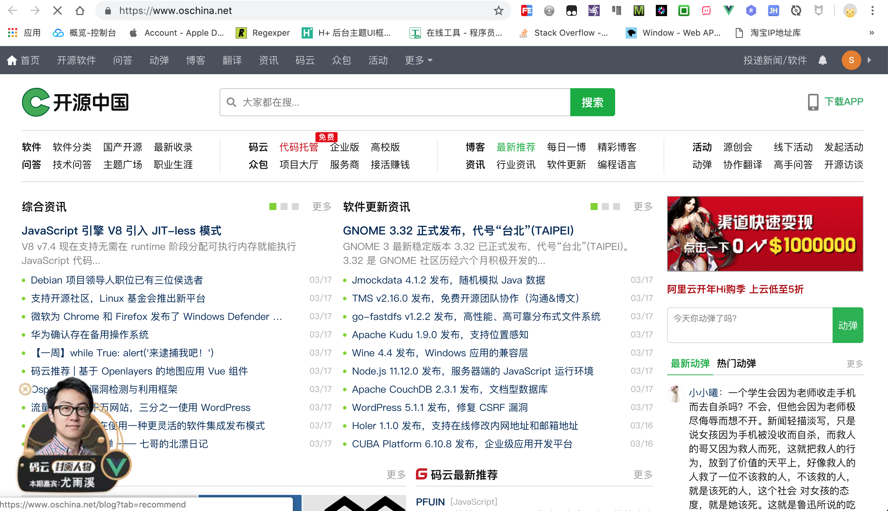
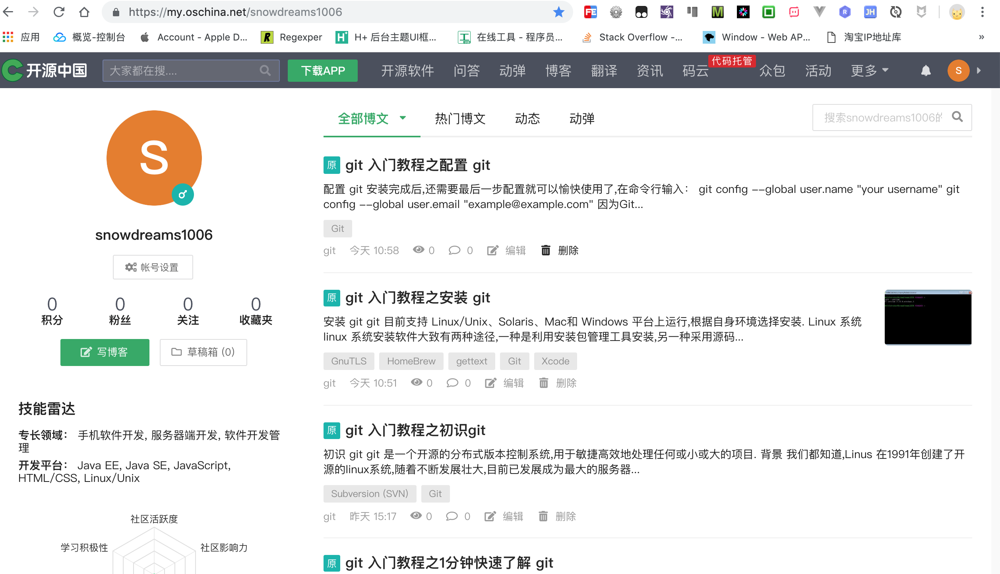
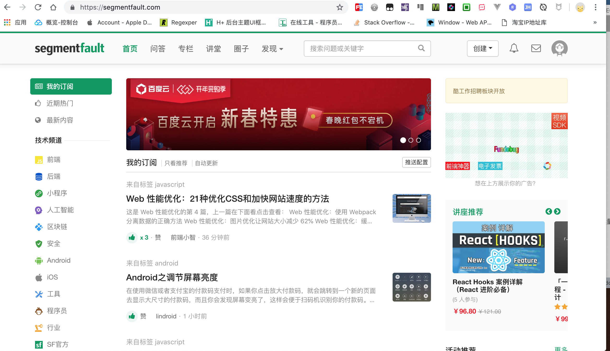
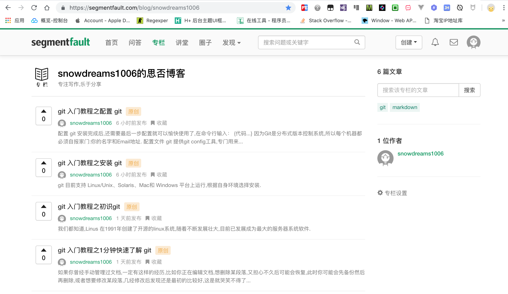
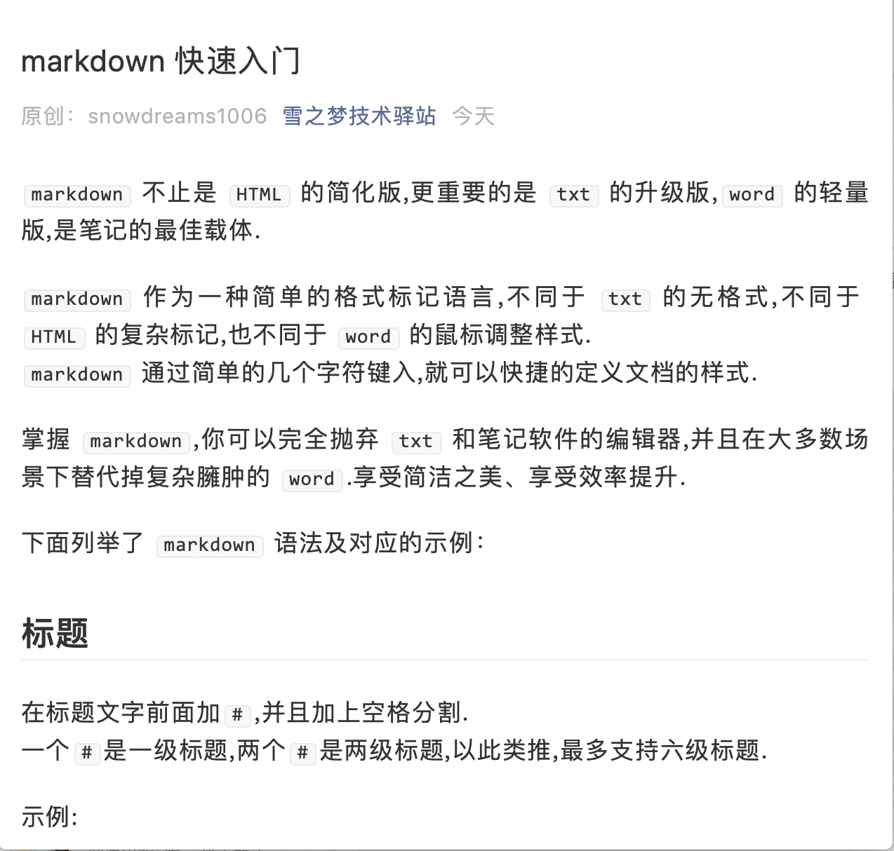
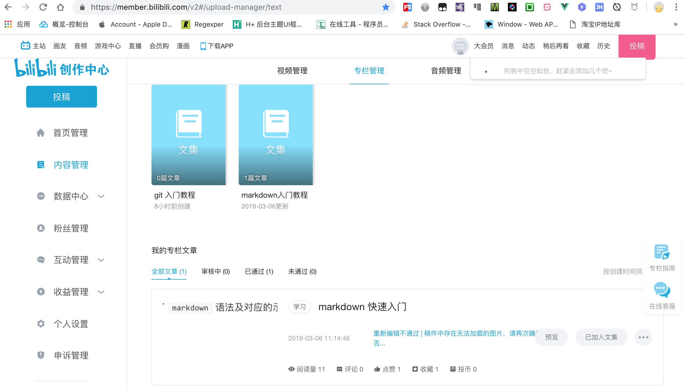

# 如何写作

越来越多的人想写个人博客或者打算做自媒体,笔者也是一样.
最近在学习如何写博客,分享下创作经历,避免走弯路.

首先在于定位,不同的定位决定了不同的平台.由于笔者分享的大多是技术类博客,所以主战场是各大主流的技术类博客论坛,当然还搭建了自己的官网.

考虑到前期仅仅是分享技术博客,无需购买专门的服务器,因此寻求免费的解决方案.
笔者采用的是 `github` 搭建个人项目官网,优点是不花一分钱,就能**免费**开启 `https` 服务,缺点是国内访问速度慢.

下面分为两部分介绍博客的创作平台,一部分是**个人官网**,另一部分是**第三方平台**.

## 个人官网

首先注册 `github` 账号(例如:用户名 `snowdreams1006`),然后新建特定规则的项目(例如:项目名 `snowdreams1006.github.io`),最后在项目下创建首页 `index.html` .现在访问 `https://用户名.github.io/`  ([https://snowdreams1006.github.io/](https://snowdreams1006.github.io/))即可.

个人官网的基本流程和特点如下:

1. 利用 `gitbook` 技术将 `markdown` 源码文件输出为 `html` 静态网页.
2. 将项目按照**特定规则**上传到 `github` 网站公开托管,生成免费网站.
3. 源代码更新后再生成输出文件,然后一起上传到 `github`,个人官网自动更新.

> 项目源码 [snowdreams1006.github.io](https://github.com/snowdreams1006/snowdreams1006.github.io),项目官网 [https://snowdreams1006.github.io/](https://snowdreams1006.github.io/)

## 第三方平台

### 1. CSDN [https://www.csdn.net/](https://www.csdn.net/)

`SEO` 优化不错,阅读量稳定,网页端阅读体验一般,手机端干净清爽,阅读量相对稳定.

不限制作者本人点赞,重复统计本人浏览记录,突出**阅读数**,其次是评论数和点赞数.

### 2. 博客园 [https://www.cnblogs.com/](https://www.cnblogs.com/)

`SEO` 优化不错,博客开通需审核,支持发布首页,但也可能因质量不达标而被移除.页面风格满满的时代感,目前暂无手机端.

限制作者本人推荐,不统计本人浏览记录,突出**推荐数**,其次是阅读量和评论数.

### 3. 开源中国 [https://www.oschina.net/](https://www.oschina.net/)

国内版 `github` ,高质量文章可能会被推荐至首页,否则阅读量几乎为零.

限制作者本人点赞,不统计本人浏览记录,突出**访问量**,其次评论数和点赞数.

### 4. 简书 [https://www.jianshu.com/](https://www.jianshu.com/)

文艺范的自媒体平台,简洁优美文艺性十足,`SEO` 优化不错,**日更活动**鼓励持续更新,**简书钻**和**简书贝**等虚拟货币增添写作乐趣!

限制作者本人点赞,不统计本人浏览记录,突出**简书钻**,其次阅读量,评论数和点赞数.

### 5. 思否 [https://segmentfault.com/](https://segmentfault.com/)

国内版`Stack OverFlow`,专注于**技术问答**,界面风格绿色清新,`SEO` 优化不错,但忽略阅读量.

限制作者本人点赞,不统计本人浏览记录,首次发布专栏需要审核,突出**投票数**,其次是收藏数,最后是阅读数.

### 6. 掘金 [https://juejin.im/timeline](https://juejin.im/timeline)

异军突起,风头正盛,时间流布局,**掘金小册子**是一大亮点,但`SEO` 很差!

不限制作者本人点赞,不重复统计本人浏览记录,突出**点赞数**,其次是评论数,最后是阅读量.

### 慕课网手记 [https://www.imooc.com/article](https://www.imooc.com/article)

`慕课网` 有着丰富的免费教学视频,手记功能只是慕课网的一个单独模块,正所谓"成也萧何败萧何",相比其他专业博客平台还有着不少的差距!

#### 近期文章

文章需要审核,然而周六周日无人审核,预期浏览量应该也很少,手记功能更多像是为了学习教学视频而写的笔记,不太像专门写的博客.

#### 小结

新产品需要磨练,配合教学视频的手机更受欢迎,毕竟可以为付费视频引流嘛!

### 微信公众号 [https://mp.weixin.qq.com/](https://mp.weixin.qq.com/)

微信公众号目前仅支持富文本编辑器,而平时写博客时大多采用 `markdown` 格式,要么重新排版布局,要么另辟蹊径.笔者采用 `markdown here` 插件将 `markdown` 格式转换成富文本格式,然后微调其中的链接和图片,基本上就完成公众号布局了.

#### 近期文章

由于微信公众号的闭环,如果没有粉丝,那肯定没有阅读量.

#### 小结

自媒体的天堂

### B站专栏 [https://www.bilibili.com/](https://www.bilibili.com/)

偶然机会发现B站开通了专栏可以投稿,于是乎投稿了博客,噩梦开始,不支持`markdown`,要求各种头图,审核,修改限制...

#### 近期文章

适合放松,不适合学习性质博客,既来之,则安之.

#### 小结

适合弹幕视频

## 总结

- `csdn` 阅读量稳定
- `博客园` 样式陈旧,无手机端
- `开源中国` 适合优质博客
- `简书` 文艺性创作
- `思否` 技术问答社区
- `掘金` 博客平台
- `慕课网手记` 教学视频配套笔记
- `微信公众号` 个人公众号
- `B站` 我大概是疯了

