# js半手动数据统计

在日常文章数据统计的过程中,纯手动方式已经难以应付,于是乎,逐步开始了程序介入方式进行统计.

在上一节中,探索利用 `csv` 文件格式进行文章数据统计,本来以为能够应付一阵子,没想到仅仅一天我就放弃了.

原因还不是因为我懒,需要复制文章内容,然后整理成**特定的** `csv` 格式,最后利用已编写的 `java` 工具类进行统计.

在这三步操作中,第一步复制文章内容最简单,第二步整理文章格式最麻烦,第三步编写 `csv` 工具类最技术.

因此,能不能再简单点?懒癌晚期,必须继续寻求新的解决方案.

> 关于如何利用 `csv` 文件处理统计数据,可以参考 [https://snowdreams1006.github.io/static-semi-manual-with-csv.html](https://snowdreams1006.github.io/static-semi-manual-with-csv.html)

## 实现效果

### 慕课手记

> [慕课手记](https://www.imooc.com/u/5224488/articles) : https://www.imooc.com/u/5224488/articles


{
    "data": {
        "x": "x",
        "columns": [
            [
                "x",
                "2019-04-01",
                "2019-04-02",
                "2019-04-03",
                "2019-04-04",
                "2019-04-05",
                "2019-04-06",
                "2019-04-07",
                "2019-04-08",
                "2019-04-09",
                "2019-04-10",
                "2019-04-11",
                "2019-04-12"
            ],
            [
                "粉丝",
                8,
                8,
                8,
                9,
                9,
                9,
                9,
                9,
                9,
                9,
                9,
                9
            ],
            [
                "阅读量",
                3508,
                3645,
                3650,
                4356,
                4528,
                4864,
                5276,
                5593,
                5872,
                5912,
                6271,
                6400
            ],
            [
                "手记",
                32,
                33,
                34,
                36,
                38,
                39,
                40,
                41,
                42,
                42,
                44,
                44
            ],
            [
                "推荐",
                36,
                36,
                37,
                39,
                41,
                42,
                48,
                49,
                50,
                50,
                52,
                52
            ],
            [
                "积分",
                107,
                118,
                118,
                130,
                130,
                141,
                152,
                173,
                173,
                173,
                194,
                195
            ]
        ],
        "axes": {
            "粉丝": "y2"
        },
        "types": {
            "粉丝": "bar"
        }
    },
    "axis": {
      "x": {
        "type": "timeseries",
        "tick": {
            "format": "%Y-%m-%d"
        }
      },
      "y2": {
        "show": "true",
        "label": { 
          "text": "粉丝",
          "position": "outer-middle"
        }
      } 
    }
}


### 简书

> [简书](https://www.jianshu.com/u/577b0d76ab87) : https://www.jianshu.com/u/577b0d76ab87


{
    "data": {
        "x": "x",
        "columns": [
            [
                "x",
                "2019-04-01",
                "2019-04-02",
                "2019-04-03",
                "2019-04-04",
                "2019-04-05",
                "2019-04-06",
                "2019-04-07",
                "2019-04-08",
                "2019-04-09",
                "2019-04-10",
                "2019-04-11",
                "2019-04-12"
            ],
            [
                "粉丝",
                7,
                7,
                6,
                7,
                6,
                5,
                5,
                5,
                5,
                5,
                5,
                5
            ],
            [
                "阅读量",
                343,
                335,
                342,
                358,
                374,
                443,
                468,
                512,
                548,
                552,
                611,
                624
            ],
            [
                "文章",
                33,
                34,
                35,
                37,
                39,
                40,
                41,
                42,
                43,
                43,
                46,
                46
            ],
            [
                "喜欢",
                57,
                58,
                59,
                60,
                62,
                64,
                65,
                67,
                68,
                68,
                68,
                71,
                71
            ],
            [
                "简书钻",
                27,
                28,
                28,
                9,9
                ,9,
                10,
                10,
                10,
                10,
                11,
                11
            ]
        ],
        "axes": {
            "粉丝": "y2"
        },
        "types": {
            "粉丝": "bar"
        }
    },
    "axis": {
      "x": {
        "type": "timeseries",
        "tick": {
            "format": "%Y-%m-%d"
        }
      },
      "y2": {
        "show": "true",
        "label": { 
          "text": "粉丝",
          "position": "outer-middle"
        }
      }
    }
}


### 博客园

> [博客园](https://www.cnblogs.com/snowdreams1006/) : https://www.cnblogs.com/snowdreams1006/


{
    "data": {
        "x": "x",
        "columns": [
            [
                "x",
                "2019-04-01",
                "2019-04-02",
                "2019-04-03",
                "2019-04-04",
                "2019-04-05",
                "2019-04-06",
                "2019-04-07",
                "2019-04-08",
                "2019-04-09",
                "2019-04-10",
                "2019-04-11",
                "2019-04-12"
            ],
            [
                "粉丝",
                17,
                17,
                17,
                18,
                18,
                18,
                18,
                18,
                18,
                18,
                18,
                18
            ],
            [
                "阅读数",
                3889,
                4096,
                4207,
                4388,
                4411,
                4435,
                4471,
                4728,
                4866,
                4867,
                5189,
                5274
            ],
            [
                "随笔",
                31,
                32,
                33,
                34,
                36,
                38,
                39,
                41,
                41,
                41,
                43,
                43
            ],
            [
                "评论数",
                16,
                16,
                16,
                16,
                16,
                16,
                16,
                16,
                16,
                16,
                16,
                16
            ]
        ],
        "axes": {
            "粉丝": "y2"
        },
        "types": {
            "粉丝": "bar"
        }
    },
    "axis": {
      "x": {
        "type": "timeseries",
        "tick": {
            "format": "%Y-%m-%d"
        }
      },
      "y2": {
        "show": "true",
        "label": {
          "text": "粉丝",
          "position": "outer-middle"
        }
      }
    }
}


### 腾讯云社区

> [腾讯云社区](https://cloud.tencent.com/developer/user/2952369/activities) : https://cloud.tencent.com/developer/user/2952369/activities


{
    "data": {
        "x": "x",
        "columns": [
            [
                "x",
                "2019-04-04",
                "2019-04-05",
                "2019-04-06",
                "2019-04-07",
                "2019-04-08",
                "2019-04-09",
                "2019-04-10",
                "2019-04-11",
                "2019-04-12"
            ],
            [
                "粉丝",
                13,
                13,
                13,
                13,
                13,
                13,
                13,
                13,
                13
            ],
            [
                "阅读量",
                1192,
                1561,
                2131,
                2144,
                2149,
                2158,
                2159,
                2163,
                2165
            ],
            [
                "文章",
                34,
                34,
                34,
                34,
                34,
                34,
                34,
                34,
                34
            ],
            [
                "点赞",
                107,
                108,
                110,
                107,
                107,
                107,
                107,
                107,
                107
            ]
        ],
        "axes": {
            "粉丝": "y2"
        },
        "types": {
            "粉丝": "bar"
        }
    },
    "axis": {
      "x": {
        "type": "timeseries",
        "tick": {
            "format": "%Y-%m-%d"
        }
      },
      "y2": {
        "show": "true",
        "label": {
          "text": "粉丝",
          "position": "outer-middle"
        }
      }
    }
}

 
## js 抓取分析数据

下面以 `chrome` 浏览器为例,说明如何利用默认控制台抓取关键数据,本文需要一定的 `jQuery` 基础.

### 慕课手记

在目标页面右键选择**检查**选项,打开默认开发者控制台,点击最左侧的**小鼠标箭头**,然后选中关键数据,比如浏览量.

此时,开发者控制台自动滚动到**元素**(Elements)选项卡,在目标数据上右键点击**复制**(Copy),接着点击复制选择器(Copy selector),现在已经定位到阅读量的节点.

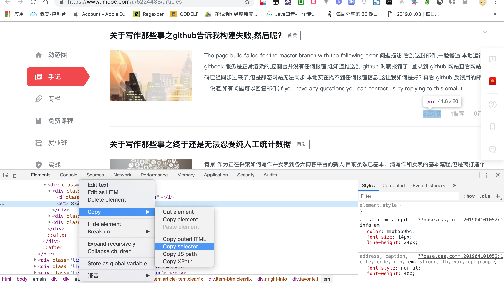

点击**控制台**(Console)选项卡,并且将选择器更改成 `jQuery` 选择器,即`$("复制的选择器").text()`,现在在控制台直接输出内容,看一下能否抓取到浏览量吧!

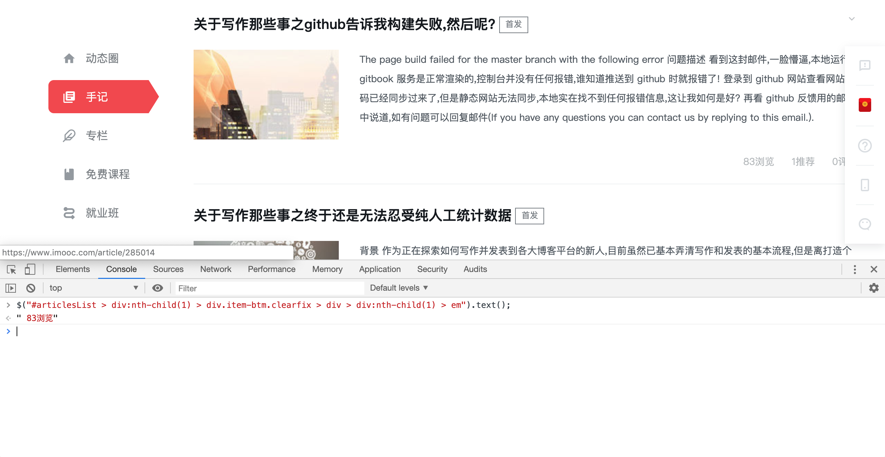

现在已经成功定位到指定元素,而我们要统计的是全部文章的阅读量,因此需要定位到全部元素.

```js
$("#articlesList > div:nth-child(1) > div.item-btm.clearfix > div > div:nth-child(1) > em").text();
```

简单分析下文章结构结合选择器分析,可以得知, 浏览,推荐和评论三者文档基本一致,唯一不同之处就是**排列顺序**而已,因此想要准确定位到浏览数,需要定位到第一个元素,推荐量则是第二个元素,因此类推.

```html
<div class="r right-info">
    <div class="favorite l">
        <i class="icon sns-thumb-up-outline"></i><em> 83浏览</em>
    </div>
    <div class="favorite l">
        <i class="icon sns-thumb-up-outline"></i><em> 1推荐</em>
    </div>
    <div class=" l">
        <i class="icon sns-comment"></i><em> 0评论</em>
    </div>    
</div>
```

弄清楚基本文档结构后,开始着手改造选择器使其定位到全部文章的浏览量,我们做如下改造.

```js
$("#articlesList div:nth-child(1) > em").text();
```

仅仅保留头部和尾部,再去掉中间部分 `> div:nth-child(1) > div.item-btm.clearfix > div >` ,这样就轻松定位到全部元素的浏览量了,是不是很简单?

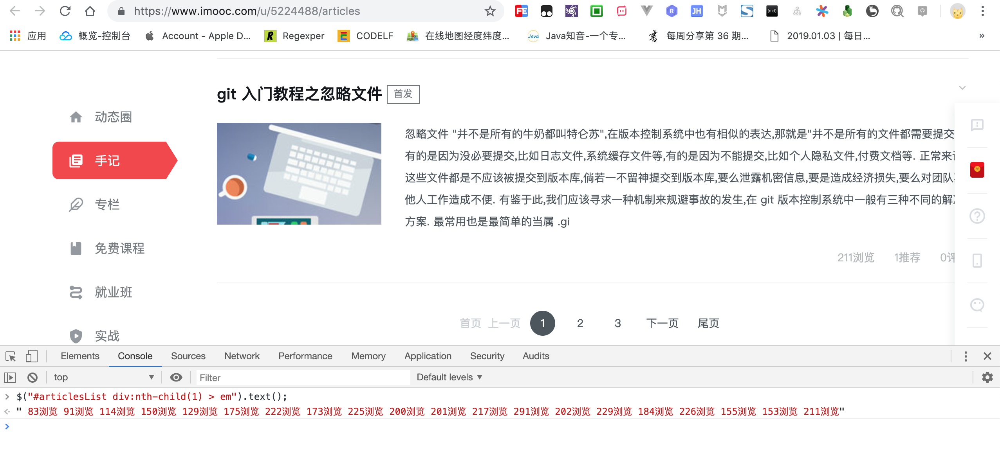

看到控制台输出结果,心里瞬间踏实了,这不刚好是**第一页**全部文章的浏览量吗?观察输出内容格式可知,我们需要将整个字符串按照**空格**分割成字符串数组.

需要注意的是,行首还有一个空格哟,因此在分割成字符串数组前,我们先将行首的空格去除掉.

```js
// 去除空格前:" 83浏览 91浏览 114浏览 150浏览 129浏览 175浏览 222浏览 173浏览 225浏览 200浏览 201浏览 217浏览 291浏览 202浏览 229浏览 184浏览 226浏览 155浏览 153浏览 211浏览"

$("#articlesList div:nth-child(1) > em").text().trim();

// 去除空格后: "83浏览 91浏览 114浏览 150浏览 129浏览 175浏览 222浏览 173浏览 225浏览 200浏览 201浏览 217浏览 291浏览 202浏览 229浏览 184浏览 226浏览 155浏览 153浏览 211浏览"
```

现在我们再将这整个字符串按照空格分割成字符串数组.

```js
// 分割字符串前: "83浏览 91浏览 114浏览 150浏览 129浏览 175浏览 222浏览 173浏览 225浏览 200浏览 201浏览 217浏览 291浏览 202浏览 229浏览 184浏览 226浏览 155浏览 153浏览 211浏览"

$("#articlesList div:nth-child(1) > em").text().trim().split(" ");

// 分割字符串后: ["83浏览", "91浏览", "114浏览", "150浏览", "129浏览", "175浏览", "222浏览", "173浏览", "225浏览", "200浏览", "201浏览", "217浏览", "291浏览", "202浏览", "229浏览", "184浏览", "226浏览", "155浏览", "153浏览", "211浏览"]
```

现在我们已经够将整个字符串分割成一个个小的字符串,下面需要再将`83浏览`中的`浏览`去掉,仅仅保留数字`83`.

```js
$.each($("#articlesList div:nth-child(1) > em").text().trim().split(" "),function(idx,ele){
     console.log(ele.substr(0,ele.lastIndexOf("浏览")));
});
```

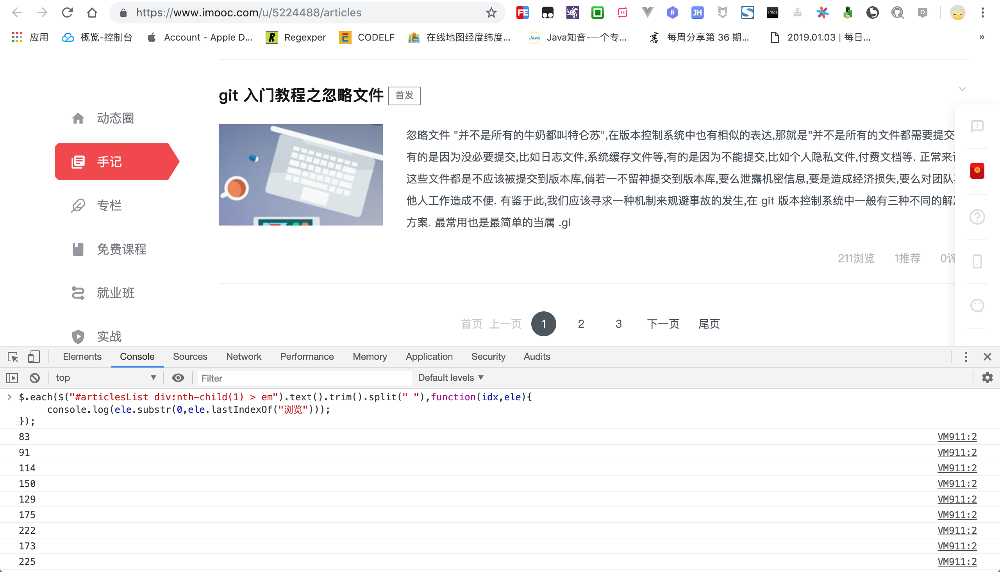

现在我们已经抓取到真正的浏览量,接下来就比较简单了,直接将这些浏览量进行累加即可,需要注意的是,这里的浏览数还是字符串类型,需要转换成数字类型才能进行累加运算哟!

```js
//阅读量
var readCount = 0;
$.each($("#articlesList div:nth-child(1) > em").text().trim().split(" "),function(idx,ele){
     readCount += parseInt(ele.substr(0,ele.lastIndexOf("浏览")));
});
console.log("阅读量: " + readCount);
```
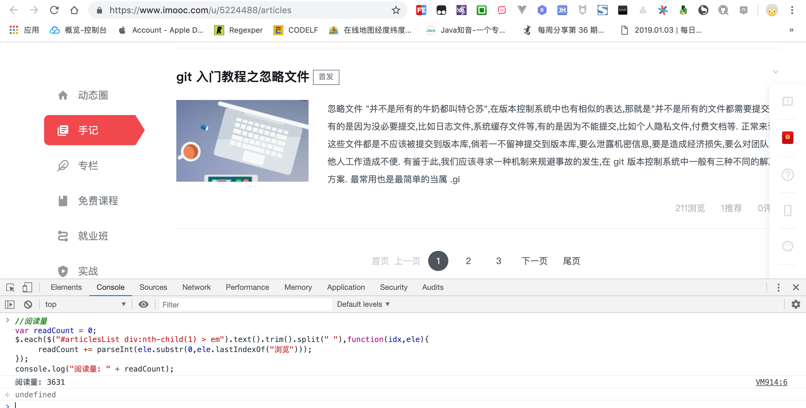

#### 小结

我们以 `chrome` 浏览器为例,讲解了如何利用自带的控制台工具抓取关键数据,从页面结构分析入口,一步一个脚印提取有效数据,最终从一条数据变成多条数据,进而实现数据的累加统计.

总体来说,还是比较简单的,并不需要太多的基础知识,但还是稍微总结其中涉及到的 `jQuery` 知识点吧!

- 定位到具体元素: `$("这里是复制的选择器")`
- 定位到具体元素内容: `$("这里是复制的选择器").text()`
- 去除字符串首尾空格: `$("这里是复制的选择器").text().trim()`
- 将字符串按照**空格**分割成字符串数组: `$("这里是复制的选择器").text().trim().split(" ")`
- 截取字符串指定部分: `ele.substr(0,ele.lastIndexOf("浏览")`
- 将字符串转化成数字类型: `parseInt(ele.substr(0,ele.lastIndexOf("浏览")));`
- 变量累加求和: `readCount += parseInt(ele.substr(0,ele.lastIndexOf("浏览")));`

完整示例:

```js
//阅读量
var readCount = 0;
$.each($("#articlesList div:nth-child(1) > em").text().trim().split(" "),function(idx,ele){
     readCount += parseInt(ele.substr(0,ele.lastIndexOf("浏览")));
});
console.log("阅读量: " + readCount);

//推荐量
var recommendCount = 0;
$.each($("#articlesList div:nth-child(2) > em").text().trim().split(" "),function(idx,ele){
     recommendCount += parseInt(ele.substr(0,ele.lastIndexOf("推荐")));
});
console.log("推荐量: " + recommendCount);

//评论量
var commendCount = 0;
$.each($("#articlesList div:nth-child(3) > em").text().trim().split(" "),function(idx,ele){
     commendCount += parseInt(ele.substr(0,ele.lastIndexOf("评论")));
});
console.log("评论量: " + commendCount);
```

### 简书

简书的文章数据不一定很规整,比如有的发布文章还没有简书钻,所以阅读量的排列顺序就是不确定的,这一点不像前面介绍的慕课手记,但是简书的关键数据前面是有小图标的,因此我们可以利用图标定位到旁边的数据.

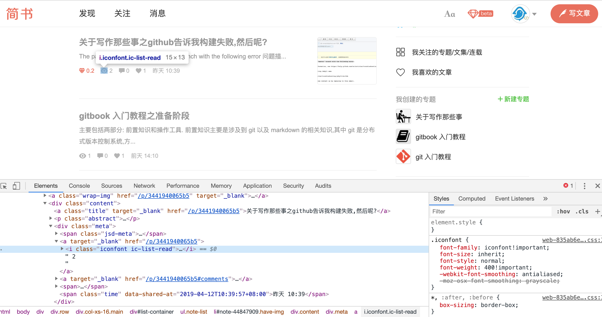

按照前面介绍的步骤,我们仍然定位到阅读量,然而 `#note-44847909 > div > div > a:nth-child(2) > i` 却不能直接使用,因为我们刚刚分析了,简书不能利用顺序定位只能用图标辅助定位.

所以,还是先看看文档结构,尝试着直接定位到全部的**阅读量小图标**.


经过分析文章结构,我们可以很轻松定位到全部阅读小图标,当然这是一个元素数组,并不是字符串数组哟!

```js
$("#list-container .ic-list-read")
```

接下来我们看一下能否正确定位到每一个小图标,进而定位到小图标左侧的阅读量.


现在我们已经能够定位到全部的阅读量小图标,现在思考如何定位到旁边的真正阅读量呢?

```html
<div class="meta">
    <span class="jsd-meta">
      <i class="iconfont ic-paid1"></i> 0.2
    </span>
    <a target="_blank" href="/p/3441940065b5">
        <i class="iconfont ic-list-read"></i> 2
    </a>        
    <a target="_blank" href="/p/3441940065b5#comments">
      <i class="iconfont ic-list-comments"></i> 0
    </a>      
    <span><i class="iconfont ic-list-like"></i> 1</span>
    <span class="time" data-shared-at="2019-04-12T10:39:57+08:00">昨天 10:39</span>
</div>
```

分析文章结构,我们发现阅读量是小图标的父节点的内容,这一下就简单了,我们顺藤摸瓜定位到父节点自然就能定位到阅读量了!

```js
$("#list-container .ic-list-read").each(function(idx,ele){
    console.log($(ele).parent().text().trim());
});
```

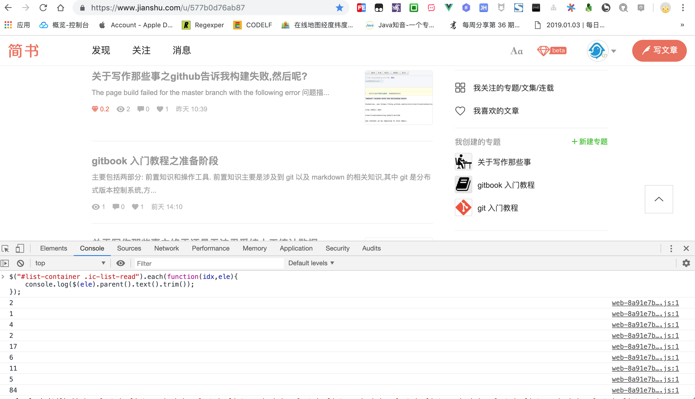

现在既然已经能够定位到阅读量,那么首先累加求和就很简单了.

```js
//阅读量
var readCount = 0;
$("#list-container .ic-list-read").each(function(idx,ele){
    readCount += parseInt($(ele).parent().text().trim());
});
console.log("阅读量: " + readCount);
```

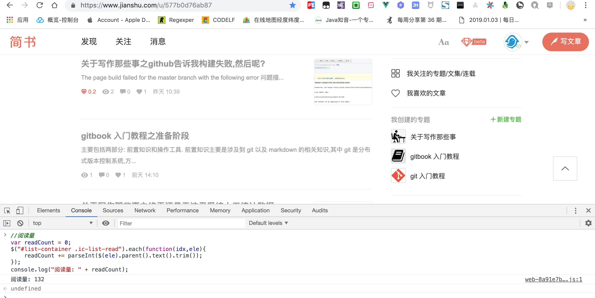

#### 小结

首先分析文章基本结构发现,简书的阅读量需要定位到阅读量小图标,进而定位到父节点,然后父节点的内容才是真正的阅读量.

定位到真正的阅读量后,一切问题迎刃而解,总结一下新增 `jQuery` 知识点.

定位到当前节点的父节点: `$(ele).parent()`

完整示例:

```js
//阅读量
var readCount = 0;
$("#list-container .ic-list-read").each(function(idx,ele){
    readCount += parseInt($(ele).parent().text().trim());
});
console.log("阅读量: " + readCount);

//评论量
var commendCount = 0;
$("#list-container .ic-list-comments").each(function(idx,ele){
    commendCount += parseInt($(ele).parent().text().trim());
});
console.log("评论量: " + commendCount);

//喜欢量
var recommendCount = 0;
$("#list-container .ic-list-like").each(function(idx,ele){
    recommendCount += parseInt($(ele).parent().text().trim());
});
console.log("喜欢量: " + recommendCount);
```

### 博客园

博客园的文章列表比较复古,传统的 `table` 布局,是这几个平台中最简单的,基本上不同怎么介绍.

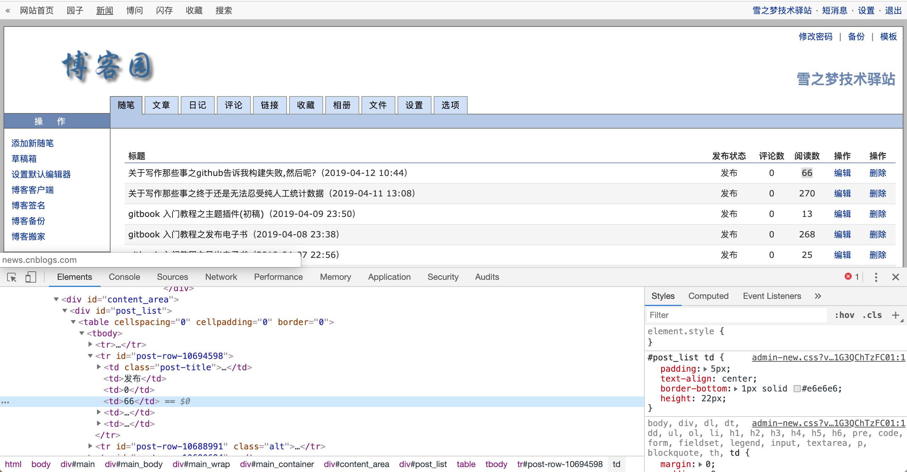

复制到阅读量选择器: `#post-row-10694598 > td:nth-child(4)` 此时再结合文章结构,因此我们可以得到全部文章的阅读量选择器.

```js
$("#post_list td:nth-child(4)")
```

接下来需要遍历数组,看看能否抓取到当前页面全部文章的阅读量.

```js
$("#post_list td:nth-child(4)").each(function(idx,ele){
    console.log($(ele).text().trim());
});
```

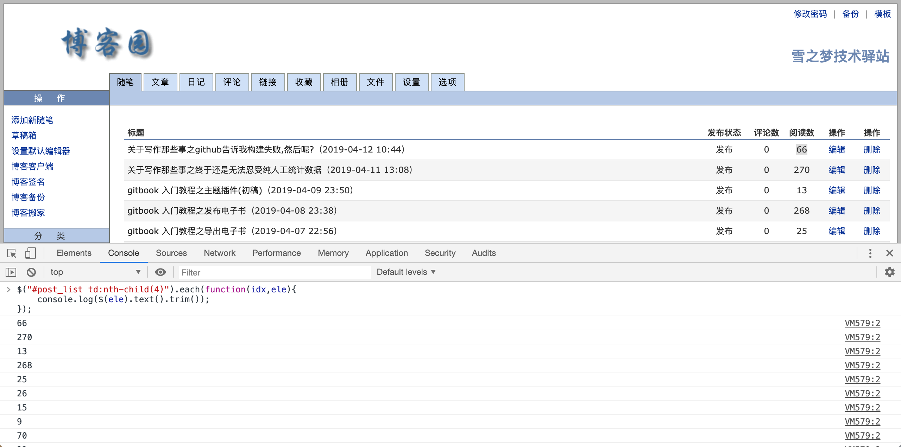

成功抓取到阅读量,现在开始累加当前页面全部文章的阅读量.

```js
//阅读数
var readCount = 0;
$("#post_list td:nth-child(4)").each(function(idx,ele){
    readCount += parseInt($(ele).text().trim());
});
console.log("阅读数: " + readCount);
```

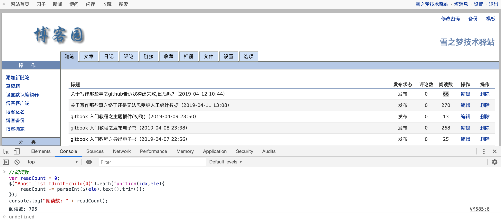

#### 小结

中规中矩的传统 `table` 布局,只需要顺序定位到具体的元素即可,需要注意的是,博客园文章页面采用了分页,如果需要统计全部文章的阅读量,需要将每页的阅读量手动累加计算.

完整示例:

```js
//评论数
var commendCount = 0;
$("#post_list td:nth-child(3)").each(function(idx,ele){
    commendCount += parseInt($(ele).text().trim());
});
console.log("评论数: " + commendCount);

//阅读数
var readCount = 0;
$("#post_list td:nth-child(4)").each(function(idx,ele){
    readCount += parseInt($(ele).text().trim());
});
console.log("阅读数: " + readCount);
```

### 腾讯云社区

大致分析腾讯云社区的文章结构,基本上和简书结构差不多,既可以像简书那种采用图标定位方式,也可以像慕课网和博客园那种直接顺序定位.

为了较为精准的定位,现在采用图标定位方式来获取阅读量.

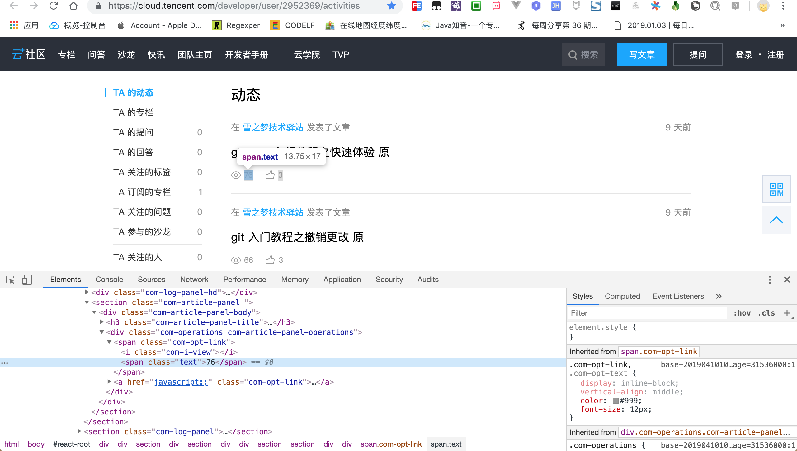

```
#react-root > div:nth-child(1) > div.J-body.com-body.with-bg > section > div > section > div > div.com-log-list > section:nth-child(1) > section > div > div > span > span
```

既然要根据图标定位,我们需要分析图标和阅读量的关系.

```html
<div class="com-operations com-article-panel-operations">
    <span class="com-opt-link">
        <i class="com-i-view"></i>
        <span class="text">76</span>
    </span>
    <a href="javascript:;" class="com-opt-link">
        <i class="com-i-like"></i>
        <span class="text">3</span>
    </a>
</div>
```

因此,我们需要做如下改造才能定位到与阅读量.

```js
$("#react-root .com-i-view").each(function(idx,ele){
    console.log($(ele).next().text().trim());
});
```


定位到阅读量,接下来就是简单的数据累加求和了.

```js
//阅读量
var readCount = 0;
$("#react-root .com-i-view").each(function(idx,ele){
    readCount += parseInt($(ele).next().text().trim());
});
console.log("阅读量: " + readCount);
```

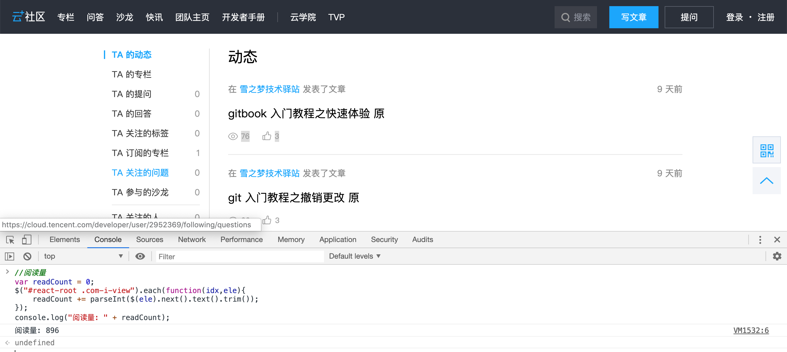

#### 小结

腾讯云社区和简书一样,采用的分页叠加模式,因此需要统计全部文章的话,只需要一直滚动直到加载出全部文章即可.

总结一下涉及到的新增 `jQuery` 知识点: 

获取当前节点的下一个节点: `$(ele).next()`

完整示例:

```js
//阅读量
var readCount = 0;
$("#react-root .com-i-view").each(function(idx,ele){
    readCount += parseInt($(ele).next().text().trim());
});
console.log("阅读量: " + readCount);

//点赞量
var recommendCount = 0;
$("#react-root .com-i-like").each(function(idx,ele){
    recommendCount += parseInt($(ele).next().text().trim());
});
console.log("点赞量: " + recommendCount);
```

## 小结

本文通过 `jQuery` 方式直接抓取文章数据,简单方便,学习成本低,能够快速上手.

慕课网和博客园的文章列表存在分页,如果需要统计全部文章浏览量,需要将每一页的文章累加,直到最后一页.
简书和腾讯云社区的文章列表虽然也有分支,但会自动累加,所以统计全部文章时只需要先等全部文章加载完毕,再利用 `js` 脚本一次性统计即可.

好了,本次分享到此结束,如果你觉得本文对你有所帮助,欢迎分享让更多人看到哦,对了,上一篇文章也是解决统计问题的,不过使用的是 `java` 读取 `csv` 文件方式,如果有兴趣,也可以[看一看](https://snowdreams1006.github.io/static-semi-manual-with-csv.html).
